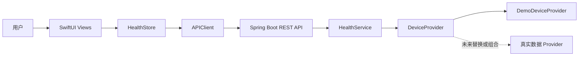

# Mars Health 项目专题

Mars Health 是一个以穿戴设备数据为主题的学习项目：iOS 客户端使用 SwiftUI 展示健康概览、趋势和设备状态，Java 后端提供统一 REST API，当前由内存中的演示 Provider 生成确定性数据。

这组文档面向有 Java 或 Spring 经验、刚开始阅读 SwiftUI 项目的开发者。重点不是逐个解释 Swift 关键字，而是沿实际运行链路回答三个问题：

1. App 从哪里启动，页面如何组合？
2. 用户操作怎样经过状态层和网络层，最终更新界面？
3. 后续接入 HealthKit 或穿戴设备厂商数据时，哪些边界可以保留，哪些模块必须替换？

> 本项目处理的是健康与生活方式信息，不提供医学诊断、急救预警或用药建议。演示数据不能用于医疗决策。

## 1. 版本与证据基线

| 项目 | 当前基线 |
| --- | --- |
| 源码目录 | `/Users/lian/Documents/project/mars-home/mars-home` |
| 阅读日期 | 2026-08-15 |
| iOS 技术 | Swift 5、SwiftUI、Combine、URLSession |
| iOS Deployment Target | iOS 26.5 |
| 后端技术 | Java 17、Spring Boot 3.4.13、Gradle Wrapper |
| 数据模式 | `DemoDeviceProvider` 内存演示数据 |
| 分析方式 | 当前工作区静态源码阅读；文档站校验与构建 |

当前 Mars Health 工作区包含尚未提交的实现，因此本文以文件和类型为证据，不把某个 Git commit 宣称为完整源码版本。文档站的构建成功也只证明文档可以被 VuePress 渲染，不等于真实 iPhone、HealthKit、Apple Watch 或厂商设备已经完成端到端验证。

## 2. 当前系统边界

从 Java 开发者的视角，可以先这样理解：

| Mars Health 组件 | 类比 Java/Spring | 职责 |
| --- | --- | --- |
| SwiftUI View | 模板 + Controller 的展示部分 | 声明界面并发送用户意图 |
| `HealthStore` | ViewModel + application service | 持有可观察状态并编排请求 |
| `APIClient` | Feign client / RestClient | 维护服务地址、HTTP 请求和 JSON 解码 |
| `HealthController` | Spring MVC Controller | 暴露 `/api/v1` HTTP 契约 |
| `HealthService` | Service | 校验输入并协调 Provider |
| `DeviceProvider` | 领域端口 / Repository 接口 | 隔离具体数据来源 |
| `DemoDeviceProvider` | 内存测试实现 | 生成手表、戒指和趋势演示数据 |

这个结构的关键价值是：SwiftUI 页面只认识自己的模型和 REST 契约，不需要理解 HealthKit、BLE、厂商 OAuth 或 webhook 的细节。真实数据接入应尽量在数据来源边界内演进，而不是把厂商协议直接散落到页面中。

## 3. 当前已经实现什么

- 四个底部页面：概览、趋势、设备、我的。
- 今日健康分、心率、血氧、步数、睡眠、恢复进度和活动热量展示。
- 7 天或 30 天趋势切换、平均值/最高值/最低值和逐日数据。
- 添加演示手表或戒指、同步设备、删除设备。
- 后端不可用时保留预览概览和设备，并生成本地趋势演示数据。
- 通过 `MARS_API_BASE_URL` 切换后端地址，支持模拟器和局域网真机调试。
- Spring `DeviceProvider` 接入边界及 REST 接口回归测试。

## 4. 当前没有实现什么

- 没有导入 `HealthKit`，也没有 HealthKit entitlement 和健康数据用途声明。
- 没有 Apple Watch companion app、WatchConnectivity 或直接手表采集链路。
- 没有厂商 SDK、厂商云 API、OAuth 绑定或 webhook。
- 没有用户账号、鉴权、数据库、幂等同步、增量游标或跨设备数据合并。
- 没有医疗诊断、异常告警或健康结论审核流程。

因此，“App 在真实 iPhone 上运行并访问 Mac 的模拟后端”与“接入真实 Apple Watch/戒指数据”是两个不同里程碑。前者是部署与网络问题，后者是数据授权、同步、归一化、隐私和产品边界问题。

## 5. 推荐阅读顺序

1. [iOS 代码实现详解](./ios-implementation.md)：沿入口、模型、状态、网络和四个页面读懂当前 SwiftUI 客户端。
2. [真实数据接入与迁移](./real-data-integration.md)：比较 HealthKit 与厂商后端路线，确定推荐落地顺序。
3. [Java 开发者的 Swift 与 SwiftUI 对照手册](../../mobile/swift-swiftui-for-java-developers.md)：遇到 `Optional`、属性包装器、闭包或并发语法时查阅通用概念。

如果目标只是把 App 跑在 iPhone 上，可以先阅读 iOS 实现文档中的“运行环境与服务地址”。如果目标是开始真实数据开发，应先完整阅读迁移文档中的“统一数据模型”和“分阶段实施”，再选择具体 API。

## 6. 阅读本文时需要区分的三个层次

### 6.1 真机运行 App

Xcode 将 SwiftUI App 安装到真实 iPhone。它解决签名、设备信任、开发者模式和本地网络权限，但不自动带来真实健康数据。

### 6.2 真机访问模拟后端

iPhone 与 Mac 在同一局域网，`MARS_API_BASE_URL` 指向 Mac 可访问的 `.local` 主机名或局域网 IP。此时界面运行在真机上，数据仍由 `DemoDeviceProvider` 生成。

### 6.3 接入真实健康数据

通过 HealthKit 读取用户授权的健康数据，或由 Java 后端接收厂商 API/SDK/webhook 数据。这个层次需要新的权限、数据模型、存储、幂等、隐私和运维设计。

## 7. 源码导航

| 想理解的问题 | 首先阅读 |
| --- | --- |
| App 从哪里启动 | `mars-home/mars_homeApp.swift` |
| JSON 对应哪些 Swift 类型 | `mars-home/Models.swift` |
| HTTP 请求如何发送 | `mars-home/APIClient.swift` 中的 `APIClient` |
| 状态如何驱动页面 | `mars-home/APIClient.swift` 中的 `HealthStore` |
| 页面如何组合 | `mars-home/ContentView.swift` |
| 颜色和通用卡片在哪里 | `mars-home/HealthTheme.swift` |
| 后端接口在哪里 | `backend/.../web/HealthController.java` |
| 演示数据在哪里生成 | `backend/.../provider/DemoDeviceProvider.java` |
| 真实数据应从哪里替换 | `backend/.../provider/DeviceProvider.java` |

## 8. 文档结论先行

当前 iOS 端的页面、状态和 API 边界足以继续演进，不需要为了接真实数据重写整套 UI。更稳妥的路线是先稳定跨来源的样本模型和 REST 契约，再实现 HealthKit 最小闭环；只有在明确需要跨平台、服务端持续同步或某个 HealthKit 不覆盖的设备时，再增加厂商后端 Provider。
