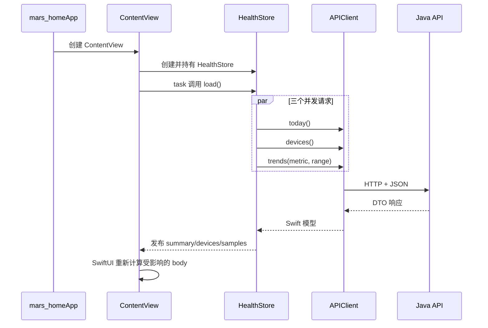
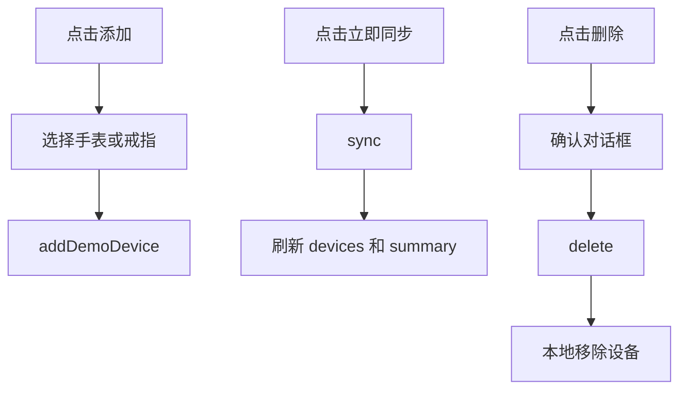
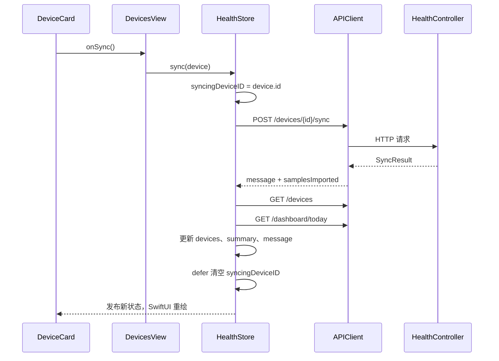

# Mars Health iOS 代码实现详解

本文不按 757 行 `ContentView.swift` 从上到下逐行翻译，而是按运行时顺序阅读：App 启动后谁创建状态、状态怎样请求接口、响应怎样触发页面重绘、用户操作又怎样回到状态层。

源码基线是 `/Users/lian/Documents/project/mars-home/mars-home` 在 2026-08-15 的当前工作区。文中所说的“在线数据”指 Java 演示服务返回的数据，不代表已经接入真实穿戴设备。

## 1. 六个 Swift 文件怎样分工

| 文件或类型 | Java/Spring 心智模型 | 实际职责 |
| --- | --- | --- |
| `mars_homeApp.swift` | `main` 启动入口 | 创建 App scene 和首个 `ContentView` |
| `Models.swift` | DTO、枚举、展示属性 | JSON 字段、页面选项、图标和单位映射 |
| `APIClient.swift` 中的 `APIClient` | Feign client / `RestClient` | 维护服务地址，发送 HTTP 请求并解码 JSON |
| `APIClient.swift` 中的 `HealthStore` | ViewModel + application service | 保存共享页面状态，编排异步请求和失败降级 |
| `ContentView.swift` | 根路由 + 页面组件 | 切换四个底部页面并声明每个页面的 UI |
| `HealthTheme.swift` | 设计令牌 + 通用组件 | 颜色、背景、在线状态和指标卡片 |

这里没有单独的 Repository 层，也没有依赖注入框架。项目规模较小时，这种结构很直接；真实数据、鉴权、缓存和测试增加后，应把 API 协议、状态和页面继续拆分，而不是让根文件无限增长。

## 2. 启动链路：从 `@main` 到首次请求

入口只有一件事：在窗口中创建 `ContentView`。

```swift
@main
struct mars_homeApp: App {
    var body: some Scene {
        WindowGroup {
            ContentView()
        }
    }
}
```

`App` 和 `View` 都是协议。`body` 不是“执行一次并永久生成控件树”，而是 SwiftUI 根据状态反复求值的界面描述。

`ContentView` 随后创建两个状态：

```swift
@StateObject private var store = HealthStore()
@State private var selectedTab: AppTab = .overview
```

- `@StateObject` 表示这个 View **拥有** `HealthStore` 的生命周期。SwiftUI 即使重新计算 `body`，也会保留同一个 Store 实例。
- `@State` 用于 View 自己拥有的小型值状态，这里只是当前底部 Tab。
- 子页面接收同一个 Store 时使用 `@ObservedObject`，只观察、不重新创建。

首次显示根 View 时，`.task` 调用 `store.load()`：

```swift
.task { await store.load() }
```

完整启动链路如下：



这与传统 MVC 中手工调用 `label.setText(...)` 不同。业务代码只修改状态，SwiftUI 负责把新状态映射到界面。

## 3. 模型层：`Codable` 同时承担 DTO 映射

### 3.1 `WearableDevice`

```swift
struct WearableDevice: Codable, Identifiable, Equatable {
    let id: String
    let name: String
    let type: String
    let status: String
    let battery: Int
    let placement: String
    let lastSynced: String
}
```

- `Codable` 让 `JSONDecoder` 按同名字段直接解码，相当于 Jackson DTO 的默认字段映射。
- `Identifiable` 要求提供 `id`，`ForEach` 用它稳定识别设备行。
- `Equatable` 允许比较值是否相同。
- `struct` 是值类型，更接近不可变 Java record，而不是共享引用的普通 Java bean。

`symbol` 和 `isConnected` 是计算属性：它们不参与 JSON，只把原始字段转换成 UI 需要的图标和布尔值。

### 3.2 `TodaySummary`、`HealthSample` 与 `SyncResult`

`TodaySummary` 对应 `/api/v1/dashboard/today`，是首页的一次性聚合 DTO。`HealthSample` 对应趋势中的单个点，`SyncResult` 对应设备同步结果。

需要注意两个契约：

1. `HealthSample.id` 直接使用 `timestamp`，同一响应内时间戳必须唯一，否则 SwiftUI 列表身份会冲突。
2. `TodaySummary` 把心率、血氧等数值固定为 `Int`，而趋势统一使用 `Double`。真实数据接入时必须先决定精度和舍入位置。

### 3.3 枚举不只是常量

`HealthMetric` 同时维护 API 值、中文名、单位和 SF Symbol：

| case | API 路径值 | 展示单位 |
| --- | --- | --- |
| `.heartRate` | `heartRate` | `BPM` |
| `.bloodOxygen` | `bloodOxygen` | `%` |
| `.steps` | `steps` | `步` |
| `.sleep` | `sleep` | `小时` |

`TrendRange` 的 raw value 是 `"7"` 或 `"30"`，可以直接放入 `days` 查询参数。`AppTab` 则集中定义底部页面的标题和图标。Java 中通常需要 enum 字段、构造器和 getter 才能表达同一组映射。

### 3.4 Preview 值不是后端缓存

`WearableDevice.previews` 和 `TodaySummary.preview` 是编译进 App 的演示初值。它们的用途是让界面在后端不可用时仍有内容，也方便开发预览；它们不是最后一次在线响应的持久化缓存，App 重启后不会恢复上次真实请求结果。

## 4. 网络层：一个泛型请求函数承接全部 REST 调用

### 4.1 服务地址

```swift
static let live: APIClient = {
    let configured = ProcessInfo.processInfo.environment["MARS_API_BASE_URL"]
        ?? "http://127.0.0.1:8080"
    return APIClient(baseURL: URL(string: configured)!)
}()
```

开发环境通过 Scheme 环境变量覆盖服务地址：

- iOS Simulator：默认 `http://127.0.0.1:8080`，回环地址指向运行模拟器的 Mac。
- 真实 iPhone：不能使用 `127.0.0.1` 访问 Mac，因为它指向 iPhone 自己；应使用 Mac 可解析的 `.local` 主机名或当前局域网 IP。
- 生产环境：不应依赖 Scheme 环境变量，应使用构建配置或受控的环境配置，并强制 HTTPS。

当前代码对 `URL(string:)` 使用 `!`。如果 `MARS_API_BASE_URL` 不是合法 URL，App 会在初始化 `APIClient.live` 时崩溃，而不是显示可恢复错误。

### 4.2 API 方法表

| Swift 方法 | HTTP | 路径 | 响应模型 |
| --- | --- | --- | --- |
| `devices()` | GET | `/api/v1/devices` | `[WearableDevice]` |
| `today()` | GET | `/api/v1/dashboard/today` | `TodaySummary` |
| `trends(metric:range:)` | GET | `/api/v1/metrics/{metric}/trend?days={7|30}` | `[HealthSample]` |
| `sync(deviceID:)` | POST | `/api/v1/devices/{id}/sync` | `SyncResult` |
| `addDemoDevice(type:)` | POST | `/api/v1/devices/demo` | `WearableDevice` |
| `delete(deviceID:)` | DELETE | `/api/v1/devices/{id}` | 私有 `ActionResponse` |

Java Controller 还提供 `/api/v1/health` 和 `/api/v1/metrics/latest`，但当前 Swift 客户端没有调用这两个端点。

### 4.3 泛型 `request<T>`

```swift
private func request<T: Decodable>(
    path: String,
    method: String = "GET",
    body: Data? = nil
) async throws -> T
```

这个方法依次完成：

1. 相对 `baseURL` 生成 URL。
2. 设置 HTTP method、可选 JSON body 和 `Content-Type`。
3. 设置 8 秒超时。
4. 使用 `URLSession.data(for:)` 异步发送请求。
5. 要求响应是 HTTP 且状态码在 `200..<300`。
6. 用 `JSONDecoder` 解码调用方推断出的 `T`。

这类似把 Java 的通用 RestClient 封装和 Jackson 反序列化放在一个方法中。类型推断来自方法返回值，例如 `devices()` 声明返回 `[WearableDevice]`，编译器就知道 `request` 的 `T`。

当前网络层的限制也很明确：没有认证 Header、重试、请求日志、缓存策略、日期解码策略或服务端错误体解析。后端返回的 `code/message/requestId` 没有进入 Swift 错误模型，非 2xx 最终只保留状态码。

## 5. `HealthStore`：共享状态与请求编排中心

### 5.1 为什么是 `class`

```swift
@MainActor
final class HealthStore: ObservableObject
```

Store 需要让多个页面共享同一个身份和可变状态，因此使用引用类型 `class`。`final` 表示不设计继承。`ObservableObject` 与 `@Published` 组成 Combine 的可观察模型。

`@MainActor` 保证 Store 的属性读写在主 actor 上隔离。网络等待不会阻塞主线程；`await` 返回后，对 UI 状态的赋值仍受到主 actor 保护。这比在每个 completion handler 中手写 `DispatchQueue.main.async` 更集中。

### 5.2 哪些状态由谁写

| 属性 | 初值 | 对外写权限 | 用途 |
| --- | --- | --- | --- |
| `summary` | `TodaySummary.preview` | `private(set)` | 首页和详情当前值 |
| `devices` | `WearableDevice.previews` | `private(set)` | 设备列表和设备数量 |
| `samples` | 空数组 | `private(set)` | 趋势图与统计 |
| `isLoading` | `false` | `private(set)` | 首次加载和重连按钮状态 |
| `isOnline` | `false` | `private(set)` | 顶部状态和“我的”页说明 |
| `syncingDeviceID` | `nil` | `private(set)` | 全局串行化设备写操作 |
| `message` | `nil` | 可写 | 根页面 Alert 内容 |
| `selectedMetric` | `.heartRate` | 可写 | 趋势页和详情页共用筛选条件 |
| `selectedRange` | `.seven` | 可写 | 趋势页和详情页共用周期 |

`private(set)` 相当于公开 getter、私有 setter：View 能读取，但不能绕过 Store 直接改写服务器状态。

### 5.3 首次加载使用结构化并发

`load()` 通过三个 `async let` 并发读取概览、设备和趋势：

```swift
async let loadedSummary = client.today()
async let loadedDevices = client.devices()
async let loadedSamples = client.trends(
    metric: selectedMetric,
    range: selectedRange
)
let result = try await (loadedSummary, loadedDevices, loadedSamples)
```

与依次写三个 `await` 相比，总耗时更接近最慢的单个请求，而不是三个耗时相加。只有三个请求全部成功后，Store 才一次性提交 `summary`、`devices` 和 `samples`，所以页面不会出现一半新、一半旧的首屏组合。

代价是任何一个请求失败，整个 `do` 都进入 `catch`。当前不会保留另外两个已经成功返回的新结果，也无法告诉用户究竟是设备、概览还是趋势接口失败。

### 5.4 趋势加载与失败降级

`loadTrends()` 只读取当前 `selectedMetric` 和 `selectedRange`。失败时使用 `previewSamples` 生成本地波形，并把 `isOnline` 设为 `false`。

需要区分三种状态：

- 初始概览和设备始终先显示 Preview 值。
- 第一次完整加载失败且 `samples` 为空时，才补趋势 Preview。
- 已经成功加载过之后再次失败，`load()` 会保留旧的非空 `samples`；`loadTrends()` 则会直接覆盖成 Preview。

因此当前 UI 不是严格的“全在线或全离线”快照。`isOnline` 也只是最近一次 Store 操作的粗粒度结果：一次趋势请求成功就会设为在线，即使其他接口没有重新验证。

还有一个实际细节：7 天在线接口返回 7 个样本，但本地 7 天 Preview 数组当前包含 8 个值。`TrendChart` 只有在 `samples.count == 7` 时才显示“周一到周日”，所以离线 Preview 会显示 `1...8`。真实数据迁移前应把样本数量和周期契约统一。

### 5.5 设备写操作共用一把状态锁

`syncingDeviceID` 同时承担“正在处理哪台设备”和“禁止并发设备写操作”两个职责：

```swift
guard syncingDeviceID == nil else { return }
syncingDeviceID = device.id
defer { syncingDeviceID = nil }
```

- 同步时保存真实设备 ID。
- 新增设备时使用特殊值 `"new"`。
- 删除时同样保存设备 ID。

这能防止用户同时添加、同步或删除多台设备，但粒度是整个设备中心，而不是单台设备。同步成功后会重新请求设备列表和今日概览；新增成功只 `append` 返回设备；删除成功只从本地数组移除。

### 5.6 Alert 是全局消息通道

根 View 用一个手工 `Binding` 把 `message != nil` 转换为 Alert 是否显示。任何 Store 方法写入 `message` 都会弹出同一个“Mars Health”对话框。

优点是实现简单；缺点是成功、失败和可恢复警告没有类型区分，新的消息也可能覆盖尚未处理的消息。规模扩大后更适合使用显式枚举，例如 `idle/loading/loaded/failed`，以及区分 toast、blocking alert 和字段错误。

## 6. 四个底部页面如何组合

`ContentView` 没有使用系统 `TabView`，而是用 `switch selectedTab` 手工切换页面，再把自定义 `BottomNavigation` 叠在底部。

```swift
switch selectedTab {
case .overview: OverviewView(store: store)
case .trends: TrendsView(store: store)
case .devices: DevicesView(store: store)
case .profile: ProfileView(store: store)
}
```

所有页面共享 `HealthStore`，但页面交互状态仍由各自 `@State` 保存。这是重要边界：服务器或跨页面状态进 Store，只影响当前页面外观的临时状态留在 View。

### 6.1 概览页 `OverviewView`

本地状态：

- `category`：概览、活动、睡眠、心脏四个筛选项。
- `selectedDetailMetric`：非空时用 `.sheet(item:)` 打开指标详情。

页面从 `summary` 和 `devices` 读取数据，使用 `LazyVGrid` 组合两列指标卡片。下拉刷新调用完整 `store.load()`。点击心率、血氧、步数或睡眠卡片进入 `MetricDetailView`；活动热量和恢复进度当前没有详情入口。

### 6.2 趋势页 `TrendsView`

趋势条件直接绑定 Store：

```swift
Picker("周期", selection: $store.selectedRange)
```

指标按钮写 `store.selectedMetric`。两个 `.onChange` 分别监听指标和周期，每次变化都创建 `Task` 调用 `loadTrends()`。页面根据 `samples` 计算平均、最大、最小和值的数量；这些是 View 的计算属性，没有写回 Store。

`TrendChart` 没有依赖 Charts framework，而是用 `GeometryReader` 和多个 `RoundedRectangle` 手工绘制柱状图。每个值先按当前最小值和最大值归一化，再映射到可用高度。

### 6.3 设备页 `DevicesView`

本地状态：

- `deleteCandidate`：等待确认删除的设备。
- `showingDeviceTypes`：是否显示演示设备类型选择框。

`ForEach(store.devices)` 为每个设备创建 `DeviceCard`。卡片不直接认识 Store，而是接收 `onSync` 和 `onDelete` 闭包，这是小型组件保持独立的正确方式。

用户流程：



这里的“添加设备”只调用 `/devices/demo`，没有蓝牙扫描、配对或 OAuth 授权。界面文字已经说明连接状态由本地服务模拟。

### 6.4 我的页面 `ProfileView`

`stepGoal` 是纯本地 `@State`，Stepper 可在 2,000 到 30,000 间按 1,000 调整。它没有持久化，也不会上传后端，离开并重建页面后可能恢复默认值 8,000。

页面还展示：

- 根据 `isOnline` 推导的 API 服务状态。
- 当前 MVP 的隐私说明。
- 打开 `DisclaimerView` 的健康免责声明。
- 调用完整 `load()` 的重新连接按钮。

### 6.5 指标详情 `MetricDetailView`

详情页通过 `.sheet(item:)` 打开，使用 `@Environment(\.dismiss)` 关闭。它有自己的 `range`，但 `load()` 会把指标和周期写回共享 Store：

```swift
store.selectedMetric = metric
store.selectedRange = range
await store.loadTrends()
```

这意味着用户在详情里切换周期，也会改变趋势页稍后看到的共享筛选条件。当前实现是有意复用同一份 `samples`，但也形成页面间的隐式耦合；若以后允许多个详情并行加载，应为详情建立独立查询状态。

详情当前的 `source` 不是从 API 返回，而是按指标硬编码为 `Mars Watch S2` 或 `Aura Ring`。接真实数据时必须改成样本或聚合响应携带的来源。

### 6.6 自定义底部导航

`BottomNavigation` 接收 `@Binding var selection: AppTab`。Binding 不是复制值，而是让子 View 能读写父 View 的 `selectedTab`。点击按钮后更新 binding，根 View 的 `switch` 随即选择新页面。

## 7. 设计系统与复用组件

`HealthTheme` 集中保存背景、卡片、薄荷绿、珊瑚红和黄色等颜色。`AppBackground` 负责全屏深色背景，`StatusPill` 根据 `isOnline` 显示“实时”或“演示”，`MetricCard` 统一指标卡片的排版。

这种方式比在每个页面散落颜色字面量更容易统一修改，但它还是一个轻量静态命名空间，不是完整 Design System。字体、间距、可访问性语义和动态字体策略目前仍主要写在各页面中。

## 8. 模拟器、真机与服务地址

### 8.1 模拟器

启动 Java 后端后，默认地址 `http://127.0.0.1:8080` 可直接使用。项目共享 Scheme 的 Run Pre-action 会调用 `backend/start.sh`，复用健康的后端或构建并启动服务。

### 8.2 真实 iPhone + 模拟后端

1. iPhone 与 Mac 连接同一 Wi-Fi。
2. 在 Scheme 的 Run > Arguments > Environment Variables 设置：

   ```text
   MARS_API_BASE_URL=http://<mac-host>.local:8080
   ```

3. 先用 iPhone Safari 访问 `http://<mac-host>.local:8080/api/v1/health`。
4. 确认返回 `status: UP` 后再运行 App，并允许本地网络访问。

`Info.plist` 当前已经声明本地网络用途，并允许本地 HTTP。这个配置仅服务开发调试，不等于生产环境可以继续使用任意明文 HTTP。

### 8.3 为什么真机运行仍是演示数据

网络请求最终仍进入 `DemoDeviceProvider`。手机是真实硬件并不改变数据来源。只有引入 HealthKit 或真实厂商 Provider 后，才算进入真实健康数据链路。

## 9. 一次完整交互的数据流

以“同步设备”为例：



页面只发送“同步这台设备”的意图；串行化、请求顺序、成功提示和刷新策略都在 Store 中。这是当前代码最清楚的职责边界。

## 10. 当前实现的限制与演进点

### 10.1 状态与错误

- `isOnline` 粒度过粗，不能表达“概览成功、趋势失败”等部分在线状态。
- 所有错误被转换成固定文案，服务端 `code/message/requestId` 丢失。
- 取消任务也可能进入普通 `catch`，被显示为离线。
- Preview 与历史在线值没有显式来源标记，用户难以判断每块数据的真实来源。

### 10.2 网络与安全

- 没有登录、访问令牌、刷新令牌或请求签名。
- `@CrossOrigin(origins = "*")` 和本地 HTTP 只适合当前开发演示。
- 没有重试退避、请求幂等键、离线队列或持久化缓存。
- 非法 `MARS_API_BASE_URL` 会因强制解包崩溃。

### 10.3 数据契约

- 时间字段主要是“刚刚”“今早”等展示字符串，不适合跨时区计算。
- 趋势样本没有来源、单位、设备、原始样本 ID 或接收时间。
- 首页来源和详情来源部分硬编码，无法表达多来源合并。
- 健康分、恢复进度和 insight 的计算规则只存在于演示 Provider 的固定值中。

### 10.4 页面结构与测试

- 大部分页面放在同一个 `ContentView.swift`，继续增长会降低可读性和测试隔离。
- `HealthStore` 可以注入自定义 `APIClient`，但 `APIClient` 仍是具体结构体而非协议，mock 粒度有限。
- 当前源码没有 iOS 单元测试或 UI 测试目标的证据。
- 本地 `stepGoal` 没有持久化或业务效果。

这些限制并不妨碍理解当前 MVP，但它们决定了真实数据接入的先后顺序：先扩展可追踪的数据契约和状态模型，再接具体数据源。

## 11. Java 开发者应带走的核心认识

1. SwiftUI View 是状态的函数，不是需要手工刷新的控件集合。
2. `@StateObject` 表示创建并拥有引用状态，`@ObservedObject` 表示观察外部传入的引用状态。
3. `@State` 适合页面自己的短生命周期值，不应承载跨页面服务器状态。
4. `async/await` 让异步控制流看起来像同步代码；`async let` 用于结构化并发。
5. `Codable` 把 Swift 模型和 JSON DTO 直接连接起来，因此字段变化是前后端契约变化。
6. Store 负责编排用户意图和状态变化，View 负责声明如何展示这些状态。
7. 真机运行、访问局域网模拟后端、接入真实健康数据是三个独立问题。

下一步阅读[真实数据接入与迁移](./real-data-integration.md)，把这些现有边界映射到 HealthKit 和厂商后端两条路线。
