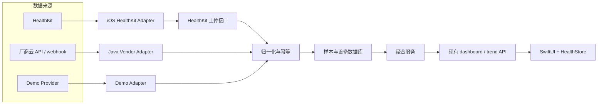
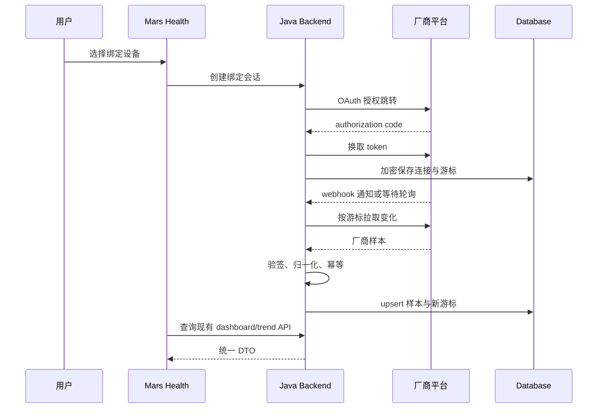

# Mars Health 真实数据接入与迁移

当前 Mars Health 的 iOS 页面和 Java REST API 已经形成一个可演进的展示边界，但数据仍来自 `DemoDeviceProvider`。接入真实数据不是把几组固定数字替换成设备读数那么简单，还必须解决授权、单位、时间、来源、去重、删除、增量同步和隐私。

本文同时覆盖两条路线：

- **路线 A：HealthKit -> iOS -> Java 后端或本地展示**
- **路线 B：厂商云 API/SDK/webhook -> Java 后端 -> iOS**

推荐不是二选一，而是先建立一套统一领域模型，再按产品目标选择来源。对于当前 iPhone 优先的 MVP，先完成 HealthKit 最小闭环通常成本更低；当产品需要跨平台、服务端持续同步或 HealthKit 不覆盖的厂商能力时，再增加厂商后端适配器。

> 所有读数仅用于健康与生活方式观察。接入真实数据不会自动把产品变成医疗器械，也不能据此输出诊断、急救或用药结论。

## 1. 先确定目标架构



这个架构保留当前 iOS 端最稳定的边界：`HealthStore -> APIClient -> /api/v1`。具体来源在后端聚合前被归一化，页面不直接理解 Apple 或任一厂商的协议。

HealthKit 也可以只在本地展示，不上传后端。但当前首页、设备列表和趋势都由后端聚合接口驱动；如果希望多设备一致、跨手机恢复和服务端统一计算健康分，上传归一化样本更符合现有结构。是否上传必须在隐私说明和授权体验中明确告知用户。

## 2. 统一数据模型是第一步

当前 `HealthSample` 只有 `timestamp` 和 `value`，无法安全承载真实数据。至少需要以下概念字段：

```text
NormalizedSample
  id                 服务端主键
  userId             数据所有者
  sourceType         HEALTH_KIT | VENDOR_API | DEMO
  sourceProvider     apple-health | vendor-name | demo
  sourceSampleId     来源侧稳定样本 ID
  deviceId           归一化设备 ID，可空
  metricType         HEART_RATE | BLOOD_OXYGEN | STEPS | SLEEP | ACTIVE_ENERGY
  value              统一单位下的数值
  unit               bpm | percent | count | second | kilocalorie
  measuredAt         采集时间，UTC instant
  measuredEndAt      区间结束时间，可空
  receivedAt         服务端接收时间
  sourceTimeZone     采集时区，例如 Asia/Shanghai
  revision           来源修订或版本，可空
  deletedAt          来源删除时间，可空
  metadata           经白名单筛选的扩展元数据
```

### 2.1 为什么需要三个不同时间

- `measuredAt`：设备实际测量时间，用于趋势和聚合。
- `receivedAt`：服务端收到时间，用于排查延迟、重放和监控。
- `sourceTimeZone`：把睡眠和“今日步数”映射到用户当地日期。

不要把“刚刚”“今早”写入数据库作为时间。它们应在展示时根据结构化时间计算。

### 2.2 为什么需要稳定来源 ID

推荐幂等键：

```text
(userId, sourceType, sourceProvider, sourceSampleId)
```

同一个 HealthKit 样本或厂商事件可能因重试、补数和后台恢复被上传多次。没有唯一约束时，步数和睡眠很容易重复累计。

HealthKit 与厂商 API 还可能代表同一物理来源。例如某个戒指厂商既把数据写入 Apple 健康，Mars Health 后端又直接拉取厂商 API。如果两条链路都启用，必须维护来源优先级或同源映射，否则会双计数。

### 2.3 不同指标不能用同一种聚合

| 指标 | 建议统一单位 | 关键聚合规则 |
| --- | --- | --- |
| 心率 | `bpm` | 保留点样本；概览可取指定窗口内最新或统计值 |
| 血氧 | `percent` | 明确 `0...1` 与 `0...100` 的转换；保留精度 |
| 步数 | `count` | 处理来源重叠，不能无条件把所有设备样本相加 |
| 睡眠 | `second` + 起止时间 | 先合并重叠区间和阶段，再计算总时长 |
| 活动热量 | `kilocalorie` | 统一能量单位和日期边界 |

`healthScore`、`readiness` 和 `insight` 不是 HealthKit 自动提供的通用字段。它们属于 Mars Health 的产品算法，必须有可版本化的计算规则、输入缺失策略和可解释边界；不能继续沿用演示 Provider 的固定值冒充真实结论。

## 3. 路线 A：通过 HealthKit 读取 Apple 健康数据

[HealthKit](https://developer.apple.com/documentation/healthkit) 是 Apple 平台上健康与健身数据的中央存储。Apple Watch 及其他获得用户授权的 App 可以向其中写入数据，Mars Health 再读取用户允许访问的类型。

这条路线的准确表述是“读取 HealthKit 中可用且获授权的数据”，不是直接连接所有 Apple Watch 传感器，也不保证第三方戒指一定把全部数据写入 HealthKit。

### 3.1 第一步：工程能力与用途声明

在 Xcode Target 的 Signing & Capabilities 中添加 HealthKit capability。按实际读写范围配置用途说明：

- `NSHealthShareUsageDescription`：说明为什么读取健康数据。
- `NSHealthUpdateUsageDescription`：只有需要写入 HealthKit 时才说明写入用途。

Apple 要求在调用其他 HealthKit API 前检查 `HKHealthStore.isHealthDataAvailable()`；用途声明缺失时，请求授权可能导致 App 崩溃。参考：[Setting up HealthKit](https://developer.apple.com/documentation/healthkit/setting-up-healthkit)、[Authorizing access to health data](https://developer.apple.com/documentation/healthkit/authorizing-access-to-health-data)。

Mars Health 当前 `Info.plist` 只有本地网络与本地 HTTP 相关配置，没有上述 HealthKit 用途声明，也没有 HealthKit entitlement。因此不能只写 `import HealthKit` 就认为接入完成。

### 3.2 第二步：按最小需要请求授权

首个版本建议只读取页面已经使用的类型：

```swift
let readTypes: Set<HKObjectType> = [
    HKQuantityType(.heartRate),
    HKQuantityType(.oxygenSaturation),
    HKQuantityType(.stepCount),
    HKQuantityType(.activeEnergyBurned),
    HKCategoryType(.sleepAnalysis),
]

try await healthStore.requestAuthorization(
    toShare: [],
    read: readTypes
)
```

这个代码片段是目标设计，不是当前仓库已有实现。正式编写时应把不可用类型安全处理，不要在类型创建处使用无条件强制解包。

HealthKit 授权有几个容易误判的语义：

- 权限按数据类型细分，用户可以只授权其中一部分。
- `requestAuthorization` 成功表示授权流程执行成功，不表示用户允许了所有读取类型。
- 为保护隐私，App 不能可靠地区分“没有此类数据”和“用户拒绝读取此类数据”。
- 用户可以只允许读取有限的近期时间窗口，也可以稍后在系统设置中改变授权。

因此页面状态应使用“可用数据/无数据/权限流程未完成/查询失败”这类中性表达，不要显示“用户拒绝了心率权限”这种 HealthKit 不一定允许 App 得出的结论。Apple 的细粒度授权说明见[官方授权文档](https://developer.apple.com/documentation/healthkit/authorizing-access-to-health-data)。

### 3.3 第三步：建立 `HealthKitClient` 边界

不要让 `OverviewView` 或 `HealthStore` 直接到处构造 `HKQuery`。建议建立可测试协议：

```swift
protocol HealthKitReading {
    func requestAccess() async throws
    func changes(
        for metric: HealthMetric,
        after anchorData: Data?
    ) async throws -> HealthKitChangeBatch
}

struct HealthKitChangeBatch {
    let samples: [NormalizedHealthSample]
    let deletedSourceIDs: [String]
    let nextAnchorData: Data
}
```

具体 `HealthKitClient` 负责 Apple 类型、单位、查询和 `HKQueryAnchor`；Store 只编排授权、同步和 UI 状态。测试时可以注入 fake client，不依赖真实 HealthKit store。

### 3.4 第四步：使用增量查询，不要每次全量扫描

[`HKAnchoredObjectQuery`](https://developer.apple.com/documentation/healthkit/hkanchoredobjectquery) 会返回新增样本、删除对象和新的 anchor。下一次把保存的 anchor 传回去，只读取上次之后的变化。

推荐策略：

1. 每个用户、每种 HealthKit 类型分别保存 anchor。
2. 首次查询使用 `nil` anchor，并用明确时间窗口限制历史范围。
3. 成功完成本地转换和服务端上传后，再原子地保存新 anchor。
4. 处理 `HKDeletedObject`，把删除同步为 tombstone，而不是只会新增。
5. 上传失败时保留旧 anchor，以便安全重试。

不要只保存“最后一个时间戳”。多个样本可能拥有相同时间，来源删除也无法靠时间戳表达。Anchor 是 HealthKit 增量语义的一部分。

### 3.5 第五步：前后台更新

[`HKObserverQuery`](https://developer.apple.com/documentation/healthkit/hkobserverquery) 可通知匹配类型出现保存或删除变化；收到通知后，再运行 anchored query 获取具体变化。Observer 通知本身不应当作样本数据。

如果需要后台交付：

- 调用 `enableBackgroundDelivery(for:frequency:)`。
- iOS 15 及更高版本需要 HealthKit Background Delivery entitlement。
- 系统控制唤醒频率，它不是硬实时数据流。
- App 必须及时调用 observer completion handler；持续不响应会停止交付。
- 设备锁定时 HealthKit store 加密，后台读取可能暂时不可用，应等待下次恢复。

官方依据：[Executing Observer Queries](https://developer.apple.com/documentation/healthkit/executing-observer-queries)、[`enableBackgroundDelivery`](https://developer.apple.com/documentation/healthkit/hkhealthstore/enablebackgrounddelivery(for:frequency:withcompletion:))。

### 3.6 HealthKit 类型到 Mars Health 指标的映射

| Mars Health | HealthKit 类型 | 转换注意点 |
| --- | --- | --- |
| 心率 | `heartRate` | 读取为 count/minute，统一成 `bpm` |
| 血氧 | `oxygenSaturation` | HealthKit 常以 `0...1` 比例表达，页面百分数需乘 100 |
| 步数 | `stepCount` | 按日期做统计查询时要处理来源重叠和时区 |
| 活动热量 | `activeEnergyBurned` | 转换为 kilocalorie |
| 睡眠 | `sleepAnalysis` | 是区间和类别数据，不是单个小时数 |

睡眠不能只把所有区间长度相加。不同来源可能记录重叠区间，阶段样本也可能嵌套；应先确定来源选择和阶段合并规则。

### 3.7 HealthKit 上传接口建议

新增独立写接口，不要复用当前“同步演示设备”语义：

```http
POST /api/v1/ingestion/healthkit/samples
Authorization: Bearer <access-token>
Idempotency-Key: <batch-id>
Content-Type: application/json
```

```json
{
  "samples": [
    {
      "sourceSampleId": "healthkit-uuid",
      "metricType": "HEART_RATE",
      "value": 68,
      "unit": "bpm",
      "measuredAt": "2026-08-15T01:20:30Z",
      "sourceTimeZone": "Asia/Shanghai",
      "deviceId": "apple-watch-logical-id"
    }
  ],
  "deletedSourceIds": []
}
```

服务端必须从认证身份确定 `userId`，不能信任请求体传入的任意用户 ID。批次成功响应应区分 accepted、duplicate 和 rejected，并允许客户端安全重试。

## 4. 路线 B：厂商数据进入 Java 后端

厂商接入适合以下目标：

- 需要 Android 或 Web 同样访问数据。
- 需要手机不在线时由服务端持续同步。
- HealthKit 不提供厂商专有指标或完整设备管理能力。
- 厂商只提供云 API、服务端 SDK 或 webhook。

不要预设所有设备都能通过 BLE 由 iPhone 直接读取。许多消费级穿戴设备的原始协议不公开，正式接入取决于厂商开发者计划、用户授权、API 配额和商业协议。

### 4.1 当前 `DeviceProvider` 能保留什么

当前调用链是：

```text
HealthController -> HealthService -> DeviceProvider -> DemoDeviceProvider
```

`HealthController` 不依赖具体 Demo 实现，这是正确的扩展方向。真实接入时应继续让 Controller 输出稳定 DTO，由 Adapter 把厂商协议转换成内部模型。

但现有 `DeviceProvider` 同时包含 `addDemoDevice`、设备操作、今日概览和趋势查询。真实 Provider 被迫实现 `addDemoDevice` 并不合理。迁移时可以先用组合 Provider 保持兼容，随后按职责拆成：

```java
public interface DeviceCatalog {
    List<DeviceData> devices(UserId userId);
}

public interface SampleRepository {
    IngestionResult upsert(List<NormalizedSample> samples);
    List<NormalizedSample> query(SampleQuery query);
}

public interface VendorSourceAdapter {
    VendorId provider();
    SyncBatch fetchChanges(Connection connection, Cursor cursor);
}
```

演示设备管理可以保留为仅在 `demo` profile 启用的独立能力。这里的接口是目标设计，不是要求一次重写当前后端。

### 4.2 典型厂商接入链路



不同厂商的细节会变化，但以下边界应固定：

1. OAuth token 和 refresh token 只由受控后端保存，静态密钥不放进 iOS App。
2. webhook 必须验证签名、时间戳和重放窗口，再异步处理。
3. webhook 通常只是“有变化”的提示，仍应按游标拉取权威数据。
4. 轮询任务需要限流、退避、断点续传和 per-user/per-provider 游标。
5. 保存新游标与样本入库必须有一致性策略，避免游标前进但数据丢失。
6. token 撤销或过期要变成明确的连接状态，让用户重新授权。

### 4.3 数据库存储建议

至少分离：

- `wearable_connection`：用户、厂商、授权状态、加密凭据引用、同步游标。
- `wearable_device`：逻辑设备、厂商设备 ID、型号、来源和最后同步时间。
- `health_sample`：归一化样本与幂等唯一键。
- `sync_job`：批次、状态、重试次数、错误码和处理水位。
- `source_event`：可选的 webhook 事件摘要、签名校验结果和去重 ID。

不要把完整 access token 写入业务日志，也不要默认长期保存未经筛选的厂商原始 payload。原始数据确有审计需要时，应定义访问控制、加密、保留期和删除机制。

### 4.4 保持 iOS REST 契约稳定

当前页面可以继续查询：

- `GET /api/v1/devices`
- `GET /api/v1/dashboard/today`
- `GET /api/v1/metrics/{type}/trend?days=7|30`

后端把数据源变化隐藏在聚合层之后。但当前 DTO 仍需演进：

- 把“刚刚”等展示字符串替换为 ISO-8601 时间字段，由客户端本地化。
- 趋势响应增加单位、来源或聚合来源摘要。
- 今日概览增加数据新鲜度、缺失指标和算法版本。
- 把来源从单个硬编码字符串升级为结构化来源列表。

新增 JSON 字段通常不会破坏 Swift `Decodable`；改变已有字段类型或删除字段会破坏解码。若要把 `source: String` 改成对象，应使用新字段或 `/api/v2`，不能原地改类型后期望旧 App 继续工作。

## 5. 两条路线如何选择

| 维度 | HealthKit -> iOS | 厂商 -> Java 后端 |
| --- | --- | --- |
| 首次开发成本 | 较低，单一 Apple 框架 | 较高，每个厂商协议不同 |
| iPhone 本地体验 | 强，可读取本机健康库 | 依赖网络和厂商云 |
| Android/Web 共用 | 弱，需要另建来源 | 强，统一从服务端查询 |
| 手机离线期间服务端同步 | 不直接具备 | 可通过 webhook/轮询持续同步 |
| 数据覆盖 | 取决于 HealthKit 已有数据和授权 | 取决于厂商 API 权限与套餐 |
| 厂商专有指标 | 可能缺失或被归一化 | 通常更完整 |
| 授权模型 | Apple 细粒度健康权限 | 厂商 OAuth + Mars Health 账号 |
| 去重难度 | 多 HealthKit source 重叠 | webhook 重放、轮询补数和多渠道重叠 |
| 最适合当前项目 | iPhone MVP、快速验证 | 跨平台、持续同步、深度厂商能力 |

推荐顺序：

1. 先完成统一样本模型、认证和数据库幂等。
2. 用 HealthKit 接通心率、步数、血氧、睡眠和活动热量最小集合。
3. 验证页面展示、来源标识、授权撤销、删除和增量恢复。
4. 只有在明确知道 HealthKit 缺少什么时，再选择第一个厂商 Provider。

这样可以避免同时面对 Apple 权限、厂商 OAuth、数据库和 UI 契约四类不确定性。

## 6. 分阶段迁移计划

### 阶段 0：固定演示基线

目标：真实数据开发期间仍能稳定运行 Demo 模式。

- 保留 `DemoDeviceProvider`，通过 Spring profile 明确启用。
- 修正 7 天 Preview 样本数量与 API 契约不一致。
- 为 iOS `APIClient`、`HealthStore` 和后端 Controller/Service 增加回归测试。
- 把“演示”“在线真实”“缓存”变成明确来源状态，而不是一个 `isOnline` 布尔值。

验收：后端关闭、Demo 模式、真实测试环境三种状态在 UI 上可以区分。

### 阶段 1：稳定身份、时间和 API 契约

目标：真实样本有归属、有来源、可追踪。

- 引入用户身份和 API 认证。
- 定义 `NormalizedSample`、统一单位和指标字典。
- 给样本增加来源 ID、测量时间、接收时间、时区和删除状态。
- 定义 dashboard/trend 的新鲜度、缺失值和算法版本语义。
- 设计兼容旧客户端的字段扩展或 `/api/v2`。

验收：同一批次重复提交不会产生重复样本；跨时区的“今日”查询有固定规则。

### 阶段 2：数据库与摄取管道

目标：用持久化存储替代进程内数组。

- 建立连接、设备、样本、同步批次和游标表。
- 添加幂等唯一键与批次事务。
- 支持新增、修订和删除 tombstone。
- 增加同步延迟、重复率、失败率和队列积压监控。

验收：服务重启后数据和游标不丢失；失败批次可重试且不会重复计数。

### 阶段 3：HealthKit 最小闭环

目标：真实 iPhone 读取用户授权数据并形成现有页面需要的聚合。

- 添加 HealthKit capability、用途声明和按需授权界面。
- 实现 `HealthKitReading` 与 anchored query。
- 映射心率、血氧、步数、睡眠和活动热量。
- 上传归一化批次，保存 per-type anchor。
- 处理部分授权、有限历史、无数据、设备锁定和用户删除。

验收：在用户明确授权的真实 iPhone 上，新增和删除样本都能增量反映到趋势；拒绝某一类型不会导致 App 崩溃或伪造数据。

### 阶段 4：真实聚合与产品指标

目标：把固定 Demo 概览替换为可解释计算。

- 定义各指标选源、去重和日界线规则。
- 为 `healthScore`、`readiness` 和 `insight` 建立版本化算法。
- 对缺失输入输出中性状态，不使用 Preview 值填充成真实结果。
- 页面展示来源、最后更新时间和数据完整度。

验收：给定固定样本集合，聚合结果可重复；算法版本可追踪；输入不足时不输出误导性健康结论。

### 阶段 5：首个厂商 Provider

目标：验证第二种来源而不破坏 HealthKit 链路。

- 选择一个有正式开发者协议和测试环境的厂商。
- 实现 OAuth、加密 token 存储、webhook 验签或增量轮询。
- 映射厂商设备、指标、单位、修订和删除语义。
- 处理“厂商数据已同步到 HealthKit”的跨来源去重。
- 保持现有查询 API 和 iOS 页面可用。

验收：token 过期、webhook 重放、限流、补数和解绑都有可复现测试；同一物理样本不会因两条来源重复计算。

### 阶段 6：隐私、删除与运营闭环

目标：具备真实用户数据的最低生产治理能力。

- 提供授权状态、解绑、撤回和删除入口。
- 支持删除服务端数据和相关凭据，并记录不含敏感值的审计事件。
- 建立隐私政策、数据清单、保留期和最小权限审查。
- 配置加密传输、密钥轮换、最小化日志和受限运维访问。
- 完成 App Store 隐私信息与目标市场适用规则审查。

验收：用户撤回授权或删除账户后，不再继续同步；删除结果可验证；运维日志不含 token 或原始健康数据。

## 7. 隐私与产品边界

HealthKit 数据属于高度敏感信息。Apple 要求按类型获得明确授权、清楚说明用途，并限制健康数据用于广告、营销或数据经纪。App 还需要提供隐私政策并申报收集的健康与健身数据。参考：[Protecting user privacy](https://developer.apple.com/documentation/healthkit/protecting-user-privacy)、[App Review Guidelines](https://developer.apple.com/app-store/review/guidelines/)、[App Privacy Details](https://developer.apple.com/app-store/app-privacy-details/)。

工程上至少遵守：

- 只请求当前功能必需的数据类型，不一次索取所有 HealthKit 权限。
- 在请求授权前说明用户能得到什么，而不是只写“为了更好体验”。
- 尽可能在设备上处理；确需上传时明确数据、目的、接收方和保留期。
- 传输使用 HTTPS，服务端敏感数据加密并执行最小权限访问。
- 不把 HealthKit 或其他个人健康信息存入 iCloud。
- 不将健康数据用于广告定向、营销画像或出售给数据经纪方。
- 对算法输出使用健康观察语言，不包装成临床诊断。
- 面向具体市场上线前，由合格的法律、隐私与合规人员审查适用要求。

## 8. 真实数据接入前的决策清单

### 产品

- [ ] 首个版本必须支持哪些指标？
- [ ] 数据只在本机展示，还是需要上传并跨设备同步？
- [ ] 健康分和恢复进度是否保留？如果保留，算法由谁负责和审核？
- [ ] 数据不足时页面显示什么，是否完全移除 Preview 值？

### iOS

- [ ] HealthKit capability、用途声明和授权时机是否明确？
- [ ] 每个类型是否有单位转换、增量 anchor 和删除处理？
- [ ] 部分授权、有限历史和无数据是否被当作正常状态？
- [ ] 后台交付失败后是否能通过前台同步恢复？

### 后端

- [ ] 用户身份、幂等键、来源模型和时间语义是否稳定？
- [ ] 样本、设备、连接和同步游标是否持久化？
- [ ] webhook 是否验签、防重放并异步处理？
- [ ] token、日志、原始 payload 和备份是否有明确保护策略？

### 测试与运营

- [ ] 重复样本、删除、修订、乱序、跨时区和夏令时是否有测试？
- [ ] HealthKit 与厂商 API 同源重复是否有测试？
- [ ] token 过期、限流、网络中断和服务重启是否可恢复？
- [ ] 用户撤回授权、解绑和删除账户是否停止后续同步？

## 9. 最终建议

对当前 Mars Health，最小风险方案是：

```text
稳定 API 和来源语义
  -> 引入数据库与幂等
  -> HealthKit 最小闭环
  -> 真实聚合替换固定分数
  -> 按明确缺口接首个厂商 Provider
  -> 完成隐私、删除和运营治理
```

不要直接把 `DemoDeviceProvider` 改成调用某个厂商 SDK，也不要让 SwiftUI View 直接查询和聚合 HealthKit。前者会把演示管理、厂商连接和查询职责继续堆在一个接口；后者会让权限、查询、单位和页面状态无法独立测试。先稳定领域契约，之后每增加一种来源都只是新增适配器，而不是再重写一遍客户端。
