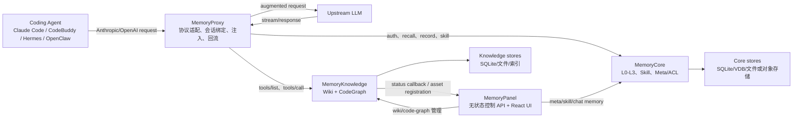

# 总体架构

系统可以分成数据面、控制面和接入面：Core/Knowledge 保存与处理资产，Panel 管理身份和装配，Proxy 把资产带进真实 Agent 请求。

图中节点映射：Proxy 入口在 `MemoryProxy/src/index.ts` 与 `src/server.ts`；Core 组装入口在 `MemoryCore/src/core/tdai-core.ts` 和 `src/gateway/server.ts`；Knowledge 在 `MemoryKnowledge/src/server.ts:createApp`、`src/module.ts:createKnowledgeModule`；Panel 在 `MemoryPanel/src/panel/http/app.ts:buildPanelApp` 与 `src/panel/panel-deps.ts:buildPanelDeps`。

## 数据所有权

| 数据 | 权威组件 | 隔离维度 |
| --- | --- | --- |
| L0 对话、L1 原子记忆 | MemoryCore | v3 写入要求 `team_id + agent_id + user_id`，可带 `session_id` |
| L2 场景、L3 Core/Persona | MemoryCore | Team + Agent 级，SDK 文档明确不消费 `session_id` |
| Skill 内容、版本、资源文件 | MemoryCore | owner、team、visibility、ACL 与 Agent binding |
| Team/User/Agent/Task/Asset/ACL | MemoryCore meta | `service_id` 实例路由，再按用户与团队授权 |
| Wiki/CodeGraph 内容与索引 | MemoryKnowledge | `x-tdai-service-id` + `team_id` + 资产 ID |
| Panel 登录会话 | 不在 Panel 本地保存 | 请求凭证向 Core 校验 |
| Proxy session/binding/cache | MemoryProxy store abstraction | Agent source、space、conversation/session 与用户身份 |

## 依赖方向与边界

### Panel 是适配层，不是第二份数据库

`buildPanelDeps` 从只读实例注册表创建 Core/Skill/Knowledge 客户端；`buildPanelApp` 把 `/api/v1/meta/*`、`skill/*`、`chat-memory/*`、`knowledge/*` 等路由挂载起来。Panel 的职责是验证浏览器传入的实例和用户头、聚合多个上游结果、执行少量控制面编排，再返回统一 envelope。

这种边界减少数据复制，但带来一个直接后果：Core 或 Knowledge 不可达时，Panel 无法从本地副本降级提供业务数据。

### Knowledge 把长任务放进每资产串行队列

`createKnowledgeModule` 组装 SQLite store、Wiki manager、CodeGraph instance pool、共享 `BuildQueue` 与真实 worker。`BuildQueue` 按资产 ID 建立 `SerialQueue`，同一资产不会并发重建，不同资产可以独立推进。创建或同步先返回 `pending`，worker 再更新 `processing → ready/failed`，完成后回调 Panel。

### CodeGraph 实例驻内存，元数据和索引落盘

CodeGraph 构建完成后，运行时把 `CodeGraphInstance` 放入 `instancePool`；重启时异步重新打开已同步索引。增量同步失败会删除该资产的工作目录并回退到新克隆。删除资产时同时关闭实例并清理池引用。

### Proxy 是协议与上下文编排边界

Proxy 不替代上游模型，也不拥有团队资产。它把不同 Agent 的请求规范化，验证 user key，恢复或建立 Team/Agent/Task 绑定，执行可组合的 injection pipeline，再转发到上游；响应完成后把可学习的对话回流 Core。当前注册的自动记忆注入器读取 L2/L3 profile 与只读工具说明，没有注册 L0/L1 自动 recall injector；L0/L1 由只读 memory bridge 按需查询。

## 关键架构决策

1. **契约目标是严格隔离，但服务端默认仍需加固。** v3 SDK 构造必须提供 `teamId/agentId/userId`；Core 只有开启 `V3_STRICT_ISOLATION` 才对缺字段返回 422，否则会补 `default`。Knowledge 所有 API 要求 `x-tdai-service-id`，跨租户按 ID 查询返回 404。
2. **知识按需暴露为工具。** Wiki/CodeGraph 不整库写进 system prompt，而是通过 `tools/list` 和 `tools/call` 让 Agent 自发现。
3. **异步派生，原始对话先落地。** 对话写入与 L1/L2/L3 生成解耦，降低前台请求等待，但必须用状态与回调观测最终结果。
4. **控制面采用端口/适配器。** Panel 的 `KnowledgeClientPort`、`MetaKernelPort`、`SkillKernelPort` 让上游实现可替换，也形成了二次开发的 mock seam。
5. **安全边界显式化。** CodeGraph 只接收 HTTPS，并默认拒绝私网地址；凭证仅经 header 和服务端注册表流动，Panel 文档禁止把真实 key 返回前端或提交仓库。

> 证据：[`MemoryKnowledge/src/server.ts`](https://github.com/TencentCloud/TencentDB-Agent-Memory/blob/0aff21a2d9f2b8a0354aaa80a2e586aab4054562/MemoryKnowledge/src/server.ts#L35-L106)、[`MemoryKnowledge/src/module.ts`](https://github.com/TencentCloud/TencentDB-Agent-Memory/blob/0aff21a2d9f2b8a0354aaa80a2e586aab4054562/MemoryKnowledge/src/module.ts#L73-L110)、[`MemoryKnowledge/src/store/build-queue.ts`](https://github.com/TencentCloud/TencentDB-Agent-Memory/blob/0aff21a2d9f2b8a0354aaa80a2e586aab4054562/MemoryKnowledge/src/store/build-queue.ts#L11-L33)、[`MemoryPanel/src/panel/http/app.ts`](https://github.com/TencentCloud/TencentDB-Agent-Memory/blob/0aff21a2d9f2b8a0354aaa80a2e586aab4054562/MemoryPanel/src/panel/http/app.ts#L15-L58)。
