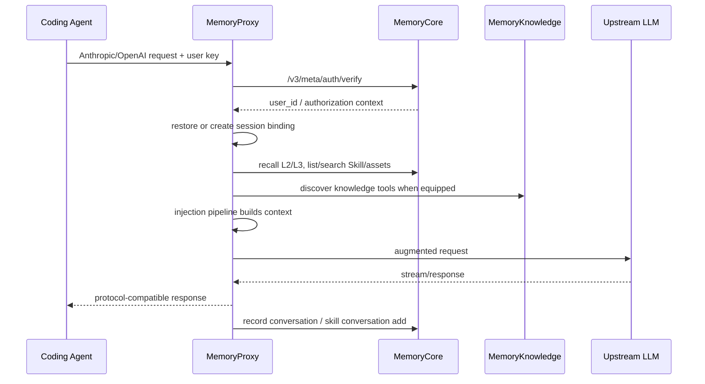
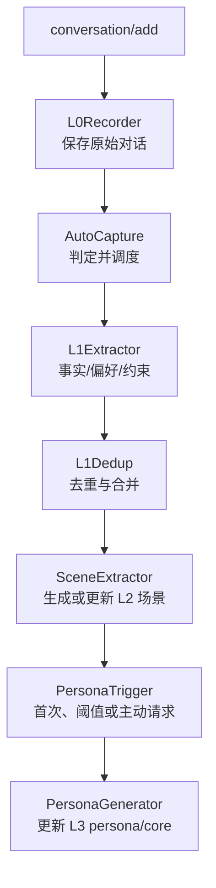

# 核心工作流

下面选取五条最能解释系统行为的链路。每条都区分同步返回与后台派生，避免把“已接收”误解为“已生成”。

## 1. Agent 请求经过 Proxy

`源码确认`：Proxy 先按 Agent adapter 识别 Claude Code、CodeBuddy 或默认协议；认证模块用 user key 换取用户身份；session 模块从显式 headers、持久化 binding 或交互式表单建立 Team/Agent/Task 上下文；injection pipeline 按注册顺序执行 L2/L3 profile、Skill 和可选 Knowledge 等 injector。Claude Code 请求还会分类为 `main`、`fork`、`sidequery`：`main` 完整处理并产生 L0/Skill 副作用，`fork` 只读注入，`sidequery` 跳过 session init 与注入。若 session init 无法完成，部分路径会 bypass 并直接转发。

关键失败点：user key 无效、Core 不可达、缺失 task 绑定、上游 LLM 失败、注入器超时。Hermes/OpenClaw 无法处理交互式表单，所以必须通过 header 预选完整三元组。

## 2. 对话从 L0 生长到 L3

前台写入首先保存 L0，然后后台任务抽取 L1。L1 不是简单摘要：代码把抽取、去重、写入和检索拆开，并可在本地 SQLite/BM25/向量检索实现之间切换。L2 以场景 Markdown 文件组织，L3 由 persona trigger 在首次场景、累计阈值、主动请求或恢复缺失正文等条件下触发。

隔离规则：L0/L1 可按 `session_id` 收敛，也可在 `(team, agent, user)` 内跨会话查询；L2/L3 是 Team + Agent 级。二次开发时若新增召回逻辑，不能把 `session_id` 错误扩展到 L2/L3，或省略 v3 的三元组。

## 3. Skill 从对话归档到版本化资产

```mermaid
flowchart LR
  Add["/v3/skill/conversation/add"] --> Buffer["BufferStorage"]
  Buffer --> Decide["阈值/超大消息/强制归档"]
  Decide --> Archive["先写 archive"]
  Archive --> Queue["tasks mutex 内登记 task + enqueue agent"]
  Queue --> Worker["agent extract-lock 的 worker"]
  Worker --> Extractor["SkillExtractor + review"]
  Extractor --> Sink["applyCandidates"]
  Sink --> Version["SkillVersioning"]
  Version --> Asset["确保 meta asset + fixed binding"]
```

`SkillConversationAddHandler.handle` 追加缓冲并决定是否归档。`SkillTriggerService.archive` 的关键不变量是“先写 archive，再登记 task”：这样 worker 不会看到没有输入文件的幽灵任务。任务登记和 agent 入队放在同一把 mutex 中；worker 以 agent 级 extract lock 保证同一 Agent 只有一个抽取者，并在失败时区分 transient 重试与 permanent 失败/DLQ。

Skill 更新不是原地覆盖。`SkillVersioning.appendNextVersion` 生成新版本目录和记录，保留 head/历史版本语义。创建 Skill 后，Gateway 还会确保同 ID 的 meta asset 存在并绑定给 owner Agent；这使 Skill 数据面与统一资产/ACL 管理面保持一致。

## 4. Wiki 异步 ingest

1. Panel 调 Knowledge `/v3/wiki/create`，创建 `(service_id, team_id, name)` 下幂等的元数据和目录壳。
2. 上传或写入 `raw/sources/*` 后调用 `/v3/wiki/ingest`。
3. `WikiService.ingest` 把状态改为 `pending` 并按 `wiki_id` 入 `BuildQueue`；接口立即返回。
4. Worker 解析该 `service_id` 的 LLM binding，执行 Wiki ingest，构建页面、全文索引和链接图，把状态改为 `ready` 或 `failed`。
5. 成功时生成摘要并回调 Panel；Panel 再把 Knowledge 元数据登记到 Core 的资产系统。

同一 Wiki 正在 `pending/processing` 时再次 ingest 返回 busy。删除可以命中正在处理的资产：服务设置取消标记，worker 在检查点退出，然后清理 DB、目录和索引。

## 5. CodeGraph 构建与同步

1. `/v3/code-graph/create` 校验 URL，只允许 HTTPS；默认拒绝内网、环回与 link-local 主机。
2. 后台 worker 对新资产浅克隆指定 branch，然后 `indexProject`；已有仓库先 `fetch + hard reset + clean`，再 `syncIndex`。
3. 增量失败时删除这个资产的本地目录并回退到重新克隆；成功后保存 commit 摘要和 files/nodes/edges 统计。
4. `CodeGraphInstance` 放入内存池；服务重启后从落盘索引恢复。
5. 自动同步默认关闭。开启后 scheduler 扫描 `ready` 资产，以 FIFO 和 worker pool 触发同步；同一资产仍受串行队列保护。

查询通过 `/v3/code-graph/{tool}` 或统一的 `/v3/tools/call` 执行。工具名和参数由路由白名单校验，而不是把任意方法名反射到引擎。

> 证据：[`MemoryProxy/src/injection/index.ts`](https://github.com/TencentCloud/TencentDB-Agent-Memory/blob/0aff21a2d9f2b8a0354aaa80a2e586aab4054562/MemoryProxy/src/injection/index.ts#L199-L307)、[`MemoryCore/src/core/skill/conversation-add/trigger-service.ts`](https://github.com/TencentCloud/TencentDB-Agent-Memory/blob/0aff21a2d9f2b8a0354aaa80a2e586aab4054562/MemoryCore/src/core/skill/conversation-add/trigger-service.ts#L105-L218)、[`MemoryKnowledge/src/module.ts`](https://github.com/TencentCloud/TencentDB-Agent-Memory/blob/0aff21a2d9f2b8a0354aaa80a2e586aab4054562/MemoryKnowledge/src/module.ts#L112-L188)、[`MemoryKnowledge/openapi.yaml`](https://github.com/TencentCloud/TencentDB-Agent-Memory/blob/0aff21a2d9f2b8a0354aaa80a2e586aab4054562/MemoryKnowledge/openapi.yaml#L148-L182)。
