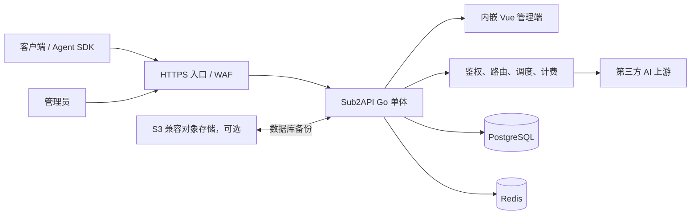

# Sub2API 项目精读与自建指南

本文不是上游 README 的翻译，而是一份面向“自己搭建”和“让 Agent 实际执行”的证据稿：先固定版本，再解释边界与链路，最后给出部署、验证、备份、升级和回滚门槛。

> [!WARNING]
> 上游明确要求合法使用，并提示项目仅供学习研究、商业使用风险由使用者自行承担。项目涉及第三方 AI 账号、OAuth 凭据、API Key、计费和支付；上线前必须独立确认软件许可证、上游服务条款、当地法律、隐私与支付合规。本文不构成法律或商业授权意见。证据见 [`README_CN.md`](https://github.com/Wei-Shaw/sub2api/blob/e803e3851c0a7e222cfadeafad7b8636ab959d11/README_CN.md#L22-L29) 与 [`LICENSE`](https://github.com/Wei-Shaw/sub2api/blob/e803e3851c0a7e222cfadeafad7b8636ab959d11/LICENSE)。

## 1. 版本基线与证据口径

| 项目 | 值 |
| --- | --- |
| 官方仓库 | [Wei-Shaw/sub2api](https://github.com/Wei-Shaw/sub2api) |
| 研究版本 | [`v0.1.176`](https://github.com/Wei-Shaw/sub2api/releases/tag/v0.1.176) |
| 固定 Commit | [`e803e3851c0a7e222cfadeafad7b8636ab959d11`](https://github.com/Wei-Shaw/sub2api/tree/e803e3851c0a7e222cfadeafad7b8636ab959d11) |
| 镜像 | `weishaw/sub2api:0.1.176` 或 `ghcr.io/wei-shaw/sub2api:0.1.176` |
| 研究日期 | 2026-08-15 |
| 实践状态 | 静态阅读官方文档、部署配置与源码；未在目标服务器执行部署 |

证据标签：

- `源码确认`：固定 commit 中的源码、Compose、配置或脚本直接表明。
- `官方资料`：固定 commit 的 README、部署文档或 GitHub Release 表明。
- `推断`：依据源码组合得出的工程结论，会说明依据。
- `待实践验证`：必须在真实域名、服务器、账号和上游服务上验证。

选择固定 tag 而不是 `main` 很重要。官方快捷脚本从 `main` 下载部署文件，官方 Compose 又默认使用 `latest`；二者都会随时间变化，无法保证复现同一套代码与配置。证据：[`docker-deploy.sh`](https://github.com/Wei-Shaw/sub2api/blob/e803e3851c0a7e222cfadeafad7b8636ab959d11/deploy/docker-deploy.sh#L23-L24)、[`docker-compose.local.yml`](https://github.com/Wei-Shaw/sub2api/blob/e803e3851c0a7e222cfadeafad7b8636ab959d11/deploy/docker-compose.local.yml#L22-L43)。

## 2. 项目定位与边界

`官方资料`：Sub2API 是 AI API 网关平台。用户使用平台签发的 API Key 调用上游 AI 服务，平台承担鉴权、计费、账号调度、并发和速率控制、请求转发及后台管理。它还内置充值支付能力。证据：[`README_CN.md`](https://github.com/Wei-Shaw/sub2api/blob/e803e3851c0a7e222cfadeafad7b8636ab959d11/README_CN.md#L182-L196)。

它解决的是“把多个上游账号或订阅统一成受控 API 服务”，不是：

- 大模型推理引擎：请求最终仍发往第三方上游。
- 通用透明反向代理：它理解协议、模型、账号、会话、用量和价格。
- 零运维 SaaS：自建者仍负责 PostgreSQL、Redis、TLS、密钥、备份和监控。
- 上游条款规避工具：技术可用不代表账号共享、转售或支付业务被允许。

`官方资料`：README 声明后端采用 Go、Gin、Ent，前端采用 Vue、Vite、TailwindCSS，最低版本口径为 PostgreSQL 15+ 与 Redis 7+。固定版本的官方 Compose 实际选择 PostgreSQL 18 和 Redis 8，因此新建环境应优先按 Compose 的当前镜像组合测试，不应反向降到最低口径。证据：[`README_CN.md`](https://github.com/Wei-Shaw/sub2api/blob/e803e3851c0a7e222cfadeafad7b8636ab959d11/README_CN.md#L207-L214)、[`docker-compose.local.yml`](https://github.com/Wei-Shaw/sub2api/blob/e803e3851c0a7e222cfadeafad7b8636ab959d11/deploy/docker-compose.local.yml#L195-L230)。

## 3. 架构与组件



`源码确认`：后端是一个 Gin 路由进程，同时挂载中间件、内嵌前端、认证、用户、管理、网关和支付路由，并非需要分别部署的微服务。证据：[`router.go`](https://github.com/Wei-Shaw/sub2api/blob/e803e3851c0a7e222cfadeafad7b8636ab959d11/backend/internal/server/router.go#L22-L95)、[`router.go`](https://github.com/Wei-Shaw/sub2api/blob/e803e3851c0a7e222cfadeafad7b8636ab959d11/backend/internal/server/router.go#L98-L134)。

| 组件 | 职责 | 持久化/失败影响 |
| --- | --- | --- |
| Sub2API | Web UI、API、鉴权、路由、计费、后台任务 | 无状态部分可重建，但依赖配置和数据 |
| PostgreSQL | 用户、账号、分组、Key、订阅、用量、迁移等主数据 | 核心持久状态，必须可靠备份 |
| Redis | 缓存、并发、限流、会话/调度辅助状态 | 故障会影响正常请求；不能简单视为可随时丢弃 |
| 反向代理 | TLS、入口限流、转发头、SSE/WebSocket | 配错会导致真实 IP、流式响应或粘性会话异常 |
| 对象存储 | 内置数据库备份的可选远端目标 | 不替代配置、Redis 与恢复演练 |

## 4. 一次网关请求怎样运行

`源码确认`：固定版本公开了 Anthropic Messages、OpenAI Responses/Chat Completions、部分 OpenAI 兼容端点、Gemini `v1beta` 以及 Antigravity 等入口；具体可用端点取决于账号平台和分组配置。证据：[`gateway.go`](https://github.com/Wei-Shaw/sub2api/blob/e803e3851c0a7e222cfadeafad7b8636ab959d11/backend/internal/server/routes/gateway.go#L175-L342)、[`gateway.go`](https://github.com/Wei-Shaw/sub2api/blob/e803e3851c0a7e222cfadeafad7b8636ab959d11/backend/internal/server/routes/gateway.go#L344-L494)。

典型链路：

1. 入口代理终止 TLS，并把请求交给 Sub2API。
2. 全局中间件记录请求、解析客户端地址、应用 CORS/CSP 等安全头。
3. 网关 API Key 中间件确认 Key、用户、订阅和允许的分组。
4. Handler 解析协议、模型、流式参数和会话标识。
5. 系统检查用户并发与计费资格，计算会话哈希。
6. 调度器按分组、平台、可用状态、负载和粘性会话选择上游账号。
7. 请求被转换并转发；流式响应持续回传。
8. 系统解析用量、记录调用与计费，并释放用户/账号并发槽。

`推断`：一个统一 Base URL 不等于所有协议、模型和能力可以任意互换。Agent 必须用目标分组实际支持的端点和模型做端到端测试，不能只以 `/health` 或后台能登录作为成功证据。

## 5. 部署方式怎么选

| 方式 | 适用场景 | 判断 |
| --- | --- | --- |
| 本地目录 Docker Compose | 单机自建、需要直观迁移和备份 | 本文默认；上游也推荐 |
| 命名卷 Docker Compose | 快速体验、熟悉 Docker 卷管理 | 可用，但迁移不如目录直观 |
| Standalone Compose | 已有托管 PostgreSQL/Redis | 适合把状态层外置 |
| 二进制 + systemd | 明确需要宿主机进程管理 | 需自行准备并运维 DB/Redis |
| Apple `container` | Apple Silicon 本地实验 | 无持续重启监管，不作为生产首选 |
| 源码构建 | 二次开发、审计、自定义镜像 | 构建链更长，先建立测试与制品流程 |

官方对目录版、命名卷版和 Apple `container` 的判断见 [`deploy/README.md`](https://github.com/Wei-Shaw/sub2api/blob/e803e3851c0a7e222cfadeafad7b8636ab959d11/deploy/README.md#L35-L47) 与 [`deploy/README.md`](https://github.com/Wei-Shaw/sub2api/blob/e803e3851c0a7e222cfadeafad7b8636ab959d11/deploy/README.md#L122-L153)。已有外部数据库时可参考 [`docker-compose.standalone.yml`](https://github.com/Wei-Shaw/sub2api/blob/e803e3851c0a7e222cfadeafad7b8636ab959d11/deploy/docker-compose.standalone.yml#L1-L70)。

## 6. 推荐生产拓扑

本文假定：一台受控 Linux 主机、一个域名、Docker Compose v2、主机上的 Caddy/Nginx，应用只监听 `127.0.0.1:8080`。

```text
Internet -> 443/TCP -> Caddy/Nginx -> 127.0.0.1:8080 -> Sub2API
                                      Docker bridge -> PostgreSQL:5432
                                                    -> Redis:6379
```

外部只开放 `22`（最好限制管理来源）与 `80/443`。不要公开 `8080`、`5432`、`6379`。Compose 已默认不映射 PostgreSQL 和 Redis 端口；应用映射地址则由 `BIND_HOST` 决定。证据：[`docker-compose.local.yml`](https://github.com/Wei-Shaw/sub2api/blob/e803e3851c0a7e222cfadeafad7b8636ab959d11/deploy/docker-compose.local.yml#L36-L43)、[`docker-compose.local.yml`](https://github.com/Wei-Shaw/sub2api/blob/e803e3851c0a7e222cfadeafad7b8636ab959d11/deploy/docker-compose.local.yml#L195-L262)。

## 7. Docker Compose 完整步骤

### 7.1 主机准备

按 Docker 官方文档安装 Engine 与 Compose 插件：

- [Install Docker Engine on Ubuntu](https://docs.docker.com/engine/install/ubuntu/)
- [Linux post-installation steps](https://docs.docker.com/engine/install/linux-postinstall/)

先记录并核对：CPU 架构、磁盘余量、域名解析、80/443 占用、防火墙、时钟同步、备份目标。Docker 组近似 root 权限，不应把普通不可信用户加入该组。

### 7.2 下载固定版本部署文件

不要直接执行 `curl .../main/... | bash`。在目标机执行：

```bash
sudo install -d -m 0750 -o "$USER" -g "$USER" /opt/sub2api-deploy
cd /opt/sub2api-deploy

SUB2API_COMMIT=e803e3851c0a7e222cfadeafad7b8636ab959d11
curl --fail --location \
  "https://raw.githubusercontent.com/Wei-Shaw/sub2api/${SUB2API_COMMIT}/deploy/docker-compose.local.yml" \
  --output docker-compose.yml
curl --fail --location \
  "https://raw.githubusercontent.com/Wei-Shaw/sub2api/${SUB2API_COMMIT}/deploy/.env.example" \
  --output .env.example
cp .env.example .env
chmod 600 .env
mkdir -p data postgres_data redis_data backups
```

保存下载文件的 SHA-256 到变更记录；这能发现文件被意外替换，但真正的可信发布流程还应验证可信来源和镜像摘要。

### 7.3 固定镜像版本

创建 `docker-compose.override.yml`：

```yaml
services:
  sub2api:
    image: weishaw/sub2api:0.1.176
```

之后所有命令都显式带两个文件，防止忘记 override：

```bash
docker compose -f docker-compose.yml -f docker-compose.override.yml config --images
```

第一次拉取后记录实际摘要：

```bash
docker pull weishaw/sub2api:0.1.176
docker image inspect weishaw/sub2api:0.1.176 \
  --format '{{index .RepoDigests 0}}'
```

`推断`：版本 tag 比 `latest` 可控，但 tag 理论上仍可能被重新推送；生产审批应记录 digest，严格环境可直接按 digest 固定。

### 7.4 配置 `.env`

至少设置以下值，不要在工单、聊天、终端录屏或 Agent 输出中回显秘密：

```dotenv
BIND_HOST=127.0.0.1
SERVER_PORT=8080
SERVER_MODE=release
TZ=Asia/Shanghai

POSTGRES_USER=sub2api
POSTGRES_DB=sub2api
POSTGRES_PASSWORD=<独立强随机值>
REDIS_PASSWORD=<独立强随机值>

ADMIN_EMAIL=<管理员邮箱>
ADMIN_PASSWORD=<首次登录用的独立强随机值>
JWT_SECRET=<openssl rand -hex 32>
TOTP_ENCRYPTION_KEY=<openssl rand -hex 32>

SECURITY_URL_ALLOWLIST_ALLOW_INSECURE_HTTP=false
SECURITY_URL_ALLOWLIST_ALLOW_PRIVATE_HOSTS=false
```

固定 `JWT_SECRET` 可避免重启后登录会话失效；固定 `TOTP_ENCRYPTION_KEY` 可避免已有 2FA 密文无法解密。证据：[`docker-compose.local.yml`](https://github.com/Wei-Shaw/sub2api/blob/e803e3851c0a7e222cfadeafad7b8636ab959d11/deploy/docker-compose.local.yml#L87-L126)。

URL 安全默认值比较宽松：allowlist 默认关闭，同时允许不安全 HTTP 和私网主机。生产应根据确实需要访问的上游收紧；若上游就是私有地址，则不能机械禁用，需改用明确 allowlist。证据：[`docker-compose.local.yml`](https://github.com/Wei-Shaw/sub2api/blob/e803e3851c0a7e222cfadeafad7b8636ab959d11/deploy/docker-compose.local.yml#L128-L152)。

### 7.5 先渲染，再启动

```bash
docker compose -f docker-compose.yml -f docker-compose.override.yml config -q
docker compose -f docker-compose.yml -f docker-compose.override.yml config --images
docker compose -f docker-compose.yml -f docker-compose.override.yml pull
docker compose -f docker-compose.yml -f docker-compose.override.yml up -d
docker compose -f docker-compose.yml -f docker-compose.override.yml ps
docker compose -f docker-compose.yml -f docker-compose.override.yml logs --tail=200 sub2api
```

`docker compose config` 是实际部署模型的最终解释结果，参见 [Docker 官方命令文档](https://docs.docker.com/reference/cli/docker/compose/config/)。审阅渲染结果时做脱敏，不要把带秘密的完整输出保存到公开 CI 日志。

### 7.6 初始化与首次登录

`源码/官方资料确认`：Compose 设置 `AUTO_SETUP=true`。首次启动会连接 PostgreSQL/Redis、执行迁移、写入配置并创建管理员；不会出现手动 Setup Wizard。未设置管理员密码时，会生成密码并写到日志。证据：[`deploy/README.md`](https://github.com/Wei-Shaw/sub2api/blob/e803e3851c0a7e222cfadeafad7b8636ab959d11/deploy/README.md#L131-L147)、[`setup.go`](https://github.com/Wei-Shaw/sub2api/blob/e803e3851c0a7e222cfadeafad7b8636ab959d11/backend/internal/setup/setup.go#L541-L650)。

建议在未公开入口前显式设置首次密码，通过 SSH 隧道登录：

```bash
ssh -L 8080:127.0.0.1:8080 deploy@example.com
```

浏览器打开 `http://127.0.0.1:8080`，完成：

1. 登录管理员并立即轮换首次密码。
2. 开启管理员 2FA，安全保存恢复材料。
3. 添加目标上游账号，只授予必要权限。
4. 建立与平台/模型匹配的分组，配置价格和并发上限。
5. 建立测试用户、订阅或余额，并生成最小权限 API Key。
6. 关闭不需要的公开注册、支付和第三方登录入口。

上述 UI 名称可能随版本变化，属于 `待实践验证`；核心对象关系由项目的管理、用户和网关路由确认。

## 8. 配置：最容易踩的坑

### 8.1 `.env` 不等于“所有变量都进容器”

`源码确认`：官方目录版 Compose 没有 `env_file: .env`，只会把 `environment` 中逐项引用的变量传给应用。因此 `.env.example` 中存在但 Compose 未引用的高级变量，单独改 `.env` 可能完全不生效。对照证据：[`docker-compose.local.yml`](https://github.com/Wei-Shaw/sub2api/blob/e803e3851c0a7e222cfadeafad7b8636ab959d11/deploy/docker-compose.local.yml#L44-L180)、[`.env.example`](https://github.com/Wei-Shaw/sub2api/blob/e803e3851c0a7e222cfadeafad7b8636ab959d11/deploy/.env.example#L1-L12)。

例如日志、H2C、部分请求体限制、调度、监控和数据库调优项，需要逐项确认固定版本 Compose 是否透传。正确处理：

1. 先用 `docker compose ... config` 查看最终容器环境。
2. 若 Compose 未传入，在 override 的 `environment` 中显式增加。
3. 或使用完整 `config.yaml`，并按官方注释挂到 `/app/data/config.yaml`。
4. 重启后用行为、日志或管理端读回验证，不能只检查源 `.env`。

### 8.2 配置层级

| 类型 | 推荐入口 | 注意事项 |
| --- | --- | --- |
| 启动必需秘密 | `.env`/秘密管理器 | 权限 `0600`，不提交 Git |
| Compose 拓扑 | Compose + override | 固定版本、监听地址、资源和环境透传 |
| 应用高级配置 | `config.yaml` 或管理后台 | 先确认优先级与持久化行为 |
| 上游账号/OAuth | 管理后台 | 按凭据级别保护，记录轮换流程 |

### 8.3 数据库与 Redis

官方目录版把应用数据、PostgreSQL 和 Redis 分别绑定到 `./data`、`./postgres_data`、`./redis_data`；Redis 启用 AOF `everysec` 与快照。证据：[`docker-compose.local.yml`](https://github.com/Wei-Shaw/sub2api/blob/e803e3851c0a7e222cfadeafad7b8636ab959d11/deploy/docker-compose.local.yml#L195-L262)。

外置托管服务时：

- PostgreSQL 使用独立数据库和最小权限用户，启用服务端支持的 TLS，配置连接池。
- Redis 使用认证、TLS、专用 DB/实例和网络 ACL。
- 先从 Sub2API 主机测试 DNS、证书链和端口，再启动迁移。
- 不要把 `DATABASE_SSLMODE=disable` 从内部 Compose 网络照搬到公网托管数据库。

迁移按文件名排序，记录文件名和校验和，使用 PostgreSQL advisory lock 防止多实例同时迁移；修改已经应用的迁移会触发校验失败。证据：[`migrations_runner.go`](https://github.com/Wei-Shaw/sub2api/blob/e803e3851c0a7e222cfadeafad7b8636ab959d11/backend/internal/repository/migrations_runner.go#L96-L175)、[`migrations_runner.go`](https://github.com/Wei-Shaw/sub2api/blob/e803e3851c0a7e222cfadeafad7b8636ab959d11/backend/internal/repository/migrations_runner.go#L189-L216)。

## 9. HTTPS 与反向代理

官方提供了可直接修改域名的 [`deploy/Caddyfile`](https://github.com/Wei-Shaw/sub2api/blob/e803e3851c0a7e222cfadeafad7b8636ab959d11/deploy/Caddyfile#L1-L60)。它按“客户端直接连接 Caddy”设计，会覆盖转发 IP 头；若 Caddy 位于 CDN 后面，不能原样使用 `{remote_host}`，必须限制源站只接受 CDN 出口并配置可信代理。证据：[`EDGE_SECURITY.md`](https://github.com/Wei-Shaw/sub2api/blob/e803e3851c0a7e222cfadeafad7b8636ab959d11/deploy/EDGE_SECURITY.md#L148-L201)。

无论使用 Caddy 还是 Nginx，都应满足：

- HTTPS，仅允许 TLS 1.2/1.3；WebAuthn 的 RP ID 与 Origin 必须匹配真实域名。
- 上游指向 `127.0.0.1:8080`，公网无法绕过代理直连应用。
- SSE/WebSocket 长连接不应用全局响应 `WriteTimeout`。
- SSE 关闭代理缓冲，不压缩 `text/event-stream`，读取超时足够长。
- 入口覆盖而不是盲目信任客户端提交的 `X-Forwarded-For`。
- 应用只信任实际反向代理的精确 IP/CIDR。

Nginx 还必须在 `http` 块启用：

```nginx
underscores_in_headers on;
```

否则 Nginx 会丢弃 `session_id` 等带下划线的头，破坏多账号粘性会话。证据：[`README_CN.md`](https://github.com/Wei-Shaw/sub2api/blob/e803e3851c0a7e222cfadeafad7b8636ab959d11/README_CN.md#L218-L226)。完整 SSE、限流和转发示例见 [`EDGE_SECURITY.md`](https://github.com/Wei-Shaw/sub2api/blob/e803e3851c0a7e222cfadeafad7b8636ab959d11/deploy/EDGE_SECURITY.md#L78-L146)。

## 10. 验证与验收

先验证基础组件：

```bash
docker compose -f docker-compose.yml -f docker-compose.override.yml ps
curl --fail --silent http://127.0.0.1:8080/health
docker compose -f docker-compose.yml -f docker-compose.override.yml \
  exec postgres pg_isready -U sub2api -d sub2api
docker compose -f docker-compose.yml -f docker-compose.override.yml \
  exec redis redis-cli ping
```

`源码确认`：`/health` 仅返回 `{"status":"ok"}`，不会主动探测 PostgreSQL 和 Redis。因此它只是 HTTP 进程活性信号，不能作为深度就绪或业务验收。证据：[`common.go`](https://github.com/Wei-Shaw/sub2api/blob/e803e3851c0a7e222cfadeafad7b8636ab959d11/backend/internal/server/routes/common.go#L9-L14)。

上线门槛还必须包括：

- 管理员可登录、2FA 可用，错误密码被拒绝。
- 创建测试 Key 后，使用真实分组和模型完成一个最小非流式请求。
- 完成一个流式请求，首个事件及时到达且连接不中途断开。
- 调用后用量、费用、账号选择和日志记录符合预期。
- 无 Key、错误 Key、无权限分组均返回受控错误。
- 从公网只能访问 HTTPS，8080/5432/6379 不可达。
- 重建应用容器后登录、2FA、用户、Key、账号和用量仍存在。
- 备份能在隔离环境恢复，不只是“备份任务显示成功”。

## 11. 备份、恢复与迁移

### 11.1 备份范围

至少保存：

- PostgreSQL 逻辑备份，这是核心业务数据。
- `.env`、Compose、override、镜像 tag 与 digest；秘密应加密保存。
- `data/` 中的应用持久文件。
- Redis 数据或可接受的重建策略。
- 反向代理配置、证书自动化配置和防火墙规则。

内置备份会调用 PostgreSQL dump 并可上传 S3 兼容存储；持久化 S3 秘密要求固定的 TOTP 加密密钥。它是 PostgreSQL 备份，不等于完整机器备份。证据：[`backup_service.go`](https://github.com/Wei-Shaw/sub2api/blob/e803e3851c0a7e222cfadeafad7b8636ab959d11/backend/internal/service/backup_service.go#L28-L70)、[`backup_service.go`](https://github.com/Wei-Shaw/sub2api/blob/e803e3851c0a7e222cfadeafad7b8636ab959d11/backend/internal/service/backup_service.go#L546-L619)。

### 11.2 升级前逻辑备份

```bash
umask 077
docker compose -f docker-compose.yml -f docker-compose.override.yml \
  exec -T postgres sh -c \
  'pg_dump -U "$POSTGRES_USER" -d "$POSTGRES_DB" --format=custom' \
  > "backups/sub2api-pre-upgrade-$(date +%Y%m%d-%H%M%S).dump"
```

同时把脱敏后的渲染配置、当前镜像摘要和 Release 链接放入同一变更记录。不要在 PostgreSQL 运行时直接复制其数据目录作为唯一备份；目录级冷备应先停止整个 Compose 栈。

### 11.3 恢复演练

在隔离主机或独立 Compose project 中创建空数据库，用 `pg_restore` 恢复，再启动相同版本 Sub2API。核对管理员、账号、分组、Key、订阅和用量抽样；随后执行真实但低成本的请求。恢复目标和容许丢失窗口应提前量化。

目录版迁移服务器时，上游建议先 `down`，再整体复制部署目录后启动。证据：[`docker-compose.local.yml`](https://github.com/Wei-Shaw/sub2api/blob/e803e3851c0a7e222cfadeafad7b8636ab959d11/deploy/docker-compose.local.yml#L15-L20)。

## 12. 升级与回滚

升级顺序：

1. 阅读目标 Release，确认数据库、Compose 和配置变化。
2. 记录当前 tag/digest、脱敏配置和验收结果。
3. 完成 PostgreSQL 与配置备份，并验证备份可读。
4. 把 override 改为新的明确 tag，执行 `config -q` 与 `pull`。
5. `up -d`，观察迁移和启动日志。
6. 依次做 HTTP、DB、Redis、登录、非流式、流式、计费和重启验证。

`官方资料`：数据库迁移是前向的；回滚需要恢复数据库备份或编写补偿 SQL。证据：[`deploy/README.md`](https://github.com/Wei-Shaw/sub2api/blob/e803e3851c0a7e222cfadeafad7b8636ab959d11/deploy/README.md#L149-L153)。

因此不能把“改回旧镜像”当成完整回滚。安全回滚是：停止写入和应用、恢复升级前 PostgreSQL（必要时连同配置/Redis）、固定旧镜像、重建并重新验收。后台在线更新的“可回滚”主要描述二进制替换能力，不保证反向数据库迁移；Compose 部署应以 Compose 镜像为制品真相。

## 13. 故障排查

| 现象 | 优先检查 | 结论边界 |
| --- | --- | --- |
| 应用不健康 | `ps`、应用日志、DB/Redis health、首次迁移 | 不要反复删数据重试 |
| 管理员无法登录 | `AUTO_SETUP`、持久目录、首次密码、JWT_SECRET | 源码构建与 Compose 初始化方式不同 |
| 重启后会话失效 | 固定 `JWT_SECRET` 是否实际传入 | 查渲染配置，不只查 `.env` |
| 2FA/备份秘密失效 | 固定 `TOTP_ENCRYPTION_KEY` 是否改变 | 丢失旧 key 可能不可逆 |
| DB 认证失败 | 容器日志、实际 DB 用户、密码与 SSL 模式 | 修改 `.env` 不等于已有角色同步变更 |
| Redis 失败 | `redis-cli ping`、密码、TLS、ACL、网络 | 先区分连接、认证和超时 |
| API 无可用账号 | 分组平台、账号状态、模型、并发、余额/订阅 | `/health` 无法发现此类问题 |
| 粘性会话异常 | `session_id` 是否到达应用 | Nginx 需允许下划线头 |
| SSE 延迟/断流 | buffering、gzip、read/send timeout、CDN | 普通 JSON 成功不证明流式成功 |
| 客户 IP 全错 | 代理覆盖头、trusted proxies、CDN 源站隔离 | 禁止盲目信任外部头 |
| 高级环境变量无效 | Compose 是否显式透传 | `docker compose config` 为准 |
| 升级迁移失败 | 超时、锁、checksum、目标版本说明 | 不要手工改已应用迁移 |
| 502 | 应用监听、回环地址、代理上游、容器状态 | 从主机本地逐层测试 |

## 14. 安全与日常运维

- 所有管理员、上游账号、API Key、数据库和对象存储秘密进入专用秘密管理流程。
- 管理员启用 2FA；敏感操作使用独立账号，保留审计和离职回收流程。
- 默认关闭不需要的注册、支付、OAuth、iframe 和在线更新入口。
- 对 Key 设置最小分组、余额、速率、并发和有效期；测试 Key 与生产 Key 分离。
- 固定镜像版本并订阅 Release；升级先备份、灰度、验收，再扩大流量。
- 监控进程、DB、Redis、队列/并发、错误率、首 Token 延迟、上游 429、成本和磁盘。
- 日志避免记录 Authorization、Cookie、OAuth token 和完整请求正文；设置留存与访问权限。
- 入口使用 CDN/WAF 或等效防护。应用内限流无法吸收带宽、TLS 或大规模 DDoS。证据：[`EDGE_SECURITY.md`](https://github.com/Wei-Shaw/sub2api/blob/e803e3851c0a7e222cfadeafad7b8636ab959d11/deploy/EDGE_SECURITY.md#L203-L209)。
- 定期做恢复演练和密钥轮换演练，而不是只观察备份成功状态。

## 15. Agent 实施 Runbook

后续部署 Agent 应把每阶段当作硬门槛；失败时停止在当前阶段，不做破坏性“清空重装”。

### Phase 0：授权与范围

- [ ] 确认目标主机、域名、SSH 身份和允许开放的端口。
- [ ] 确认上游账号、API 分发、支付与日志处理的合规边界。
- [ ] 确认允许写入 `/opt/sub2api-deploy`、防火墙和反向代理配置。
- [ ] 明确 RPO/RTO、维护窗口、备份位置和回滚审批人。

### Phase 1：制品与主机预检

- [ ] 记录 `v0.1.176`、commit、镜像 tag 与最终 digest。
- [ ] 从固定 commit 下载 Compose 和 `.env.example`，保存校验值。
- [ ] 核对 Docker/Compose、CPU、磁盘、内存、时钟、DNS 和端口。
- [ ] 确认 8080/5432/6379 不会暴露公网。

### Phase 2：秘密与配置

- [ ] 分别生成 DB、Redis、管理员、JWT、TOTP 强随机秘密。
- [ ] `.env` 权限设为 `0600`，不提交 Git，不在输出中打印值。
- [ ] `BIND_HOST=127.0.0.1`，应用镜像由 override 固定。
- [ ] 用 `docker compose config -q` 校验，用脱敏结果确认变量已透传。

### Phase 3：启动与初始化

- [ ] 拉取镜像并记录摘要，再 `up -d`。
- [ ] 查看首次迁移和管理员创建日志，不跳过错误。
- [ ] 分别验证应用 HTTP、PostgreSQL、Redis。
- [ ] 通过 SSH 隧道首次登录，轮换密码并启用 2FA。
- [ ] 建立一个最小测试账号、分组、用户和 API Key。

### Phase 4：入口与功能验收

- [ ] 配置域名、HTTPS、可信代理与源站防火墙。
- [ ] 验证公网无法访问内部端口，HTTP 正确转 HTTPS。
- [ ] 验证错误 Key 被拒绝，真实非流式请求成功并计费。
- [ ] 验证流式请求无明显缓冲或提前断开。
- [ ] 若用 Nginx，验证 `session_id` 头未被丢弃。

### Phase 5：恢复能力与交付

- [ ] 生成 PostgreSQL 备份，并在隔离环境完成一次恢复。
- [ ] 重建应用容器，确认数据、登录和 2FA 持续有效。
- [ ] 交付版本/digest、脱敏配置、端口、验证证据、告警和回滚步骤。
- [ ] 把所有 `待实践验证` 项逐项转成通过、失败或明确豁免。

Agent 禁止事项：

- 不执行来自 `main` 的未审阅管道脚本。
- 不以 `latest` 作为生产制品。
- 不读取后再回显 `.env`、Token 或用户凭据。
- 不以 `/health` 单点成功宣告部署完成。
- 不在无备份时升级，不在迁移后只降镜像版本。
- 不为排错删除 `data/`、`postgres_data/` 或 `redis_data/`。
- 不未经授权开启支付、公开注册或对外售卖能力。

## 16. 关键风险与版本敏感点

1. **发布节奏快**：教程固定于 `v0.1.176`，后续 Release 可能改变模型、计费、路由、Compose 和迁移。
2. **可变制品**：官方脚本跟随 `main`，Compose 默认 `latest`；本文改为 tag/digest 管理。
3. **配置错觉**：`.env.example` 比 Compose 实际透传项更多，必须审查渲染配置。
4. **浅健康检查**：`/health` 不探测依赖，必须分别验证 DB、Redis 和真实请求。
5. **前向迁移**：镜像降级不等于数据回滚，升级前可恢复备份是硬门槛。
6. **转发头风险**：默认兼容模式可能信任转发头；公网源站、CDN 和可信代理必须一起设计。证据：[`EDGE_SECURITY.md`](https://github.com/Wei-Shaw/sub2api/blob/e803e3851c0a7e222cfadeafad7b8636ab959d11/deploy/EDGE_SECURITY.md#L30-L67)。
7. **流式代理风险**：普通请求成功仍可能掩盖 SSE 缓冲、压缩或超时错误。
8. **秘密耦合**：JWT/TOTP key 改变分别影响会话与 2FA/加密配置恢复。
9. **备份不完整**：内置 S3 备份以 PostgreSQL 为中心，仍要保存部署配置与其他状态。
10. **上游与商业风险**：账号共享、代理、支付、价格和模型兼容性均受第三方变化影响。

## 17. 尚未确认，部署时必须补证

- `待实践验证`：目标 CPU/OS 上镜像能否正常运行，资源占用与容量上限。
- `待实践验证`：目标上游账号类型、OAuth 流程、模型和价格在部署当日是否仍兼容。
- `待实践验证`：管理端在固定版本中的具体菜单名称与最小初始化点击路径。
- `待实践验证`：所选 CDN/Caddy/Nginx 对长时间 SSE、断连取消和真实 IP 的实际行为。
- `待实践验证`：外部 PostgreSQL/Redis 的 TLS、故障切换与连接池参数。
- `待实践验证`：完整备份恢复后的 Redis 辅助状态影响，以及 RPO/RTO 是否达标。
- `版本敏感`：`datamanagementd` 需要额外 Unix Socket、宿主机工具与高权限集成，不是核心部署前置；启用前应重新审查当期文档与源码。官方入口见 [`deploy/README.md`](https://github.com/Wei-Shaw/sub2api/blob/e803e3851c0a7e222cfadeafad7b8636ab959d11/deploy/README.md#L173-L179)。

## 18. 一手资料索引

- [固定版本源码树](https://github.com/Wei-Shaw/sub2api/tree/e803e3851c0a7e222cfadeafad7b8636ab959d11)
- [Release v0.1.176](https://github.com/Wei-Shaw/sub2api/releases/tag/v0.1.176)
- [中文 README](https://github.com/Wei-Shaw/sub2api/blob/e803e3851c0a7e222cfadeafad7b8636ab959d11/README_CN.md)
- [部署说明](https://github.com/Wei-Shaw/sub2api/blob/e803e3851c0a7e222cfadeafad7b8636ab959d11/deploy/README.md)
- [目录版 Compose](https://github.com/Wei-Shaw/sub2api/blob/e803e3851c0a7e222cfadeafad7b8636ab959d11/deploy/docker-compose.local.yml)
- [Standalone Compose](https://github.com/Wei-Shaw/sub2api/blob/e803e3851c0a7e222cfadeafad7b8636ab959d11/deploy/docker-compose.standalone.yml)
- [环境变量样例](https://github.com/Wei-Shaw/sub2api/blob/e803e3851c0a7e222cfadeafad7b8636ab959d11/deploy/.env.example)
- [边缘安全指南](https://github.com/Wei-Shaw/sub2api/blob/e803e3851c0a7e222cfadeafad7b8636ab959d11/deploy/EDGE_SECURITY.md)
- [Caddy 基线](https://github.com/Wei-Shaw/sub2api/blob/e803e3851c0a7e222cfadeafad7b8636ab959d11/deploy/Caddyfile)
- [Docker Compose 配置命令](https://docs.docker.com/reference/cli/docker/compose/config/)
- [Docker Compose 启动命令](https://docs.docker.com/reference/cli/docker/compose/up/)
