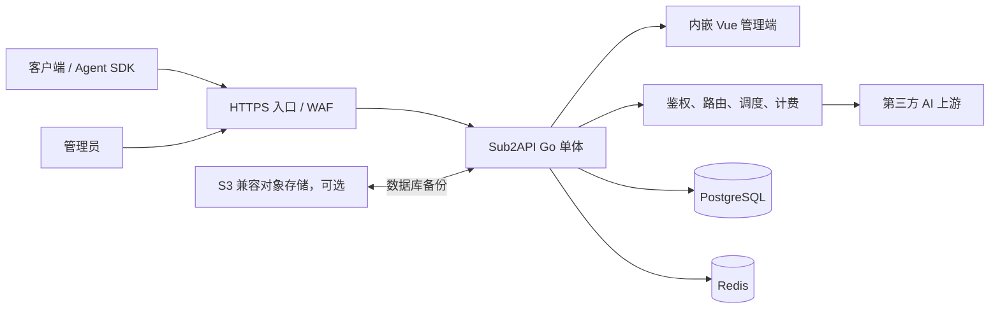

# 总体架构

## 运行拓扑

`源码确认`：Sub2API 是一个 Gin 路由进程，同时挂载中间件、内嵌前端、认证、用户、管理、网关和支付路由，而非需要分别部署的微服务。换言之，同一个 Go 进程同时提供 API 和嵌入式 Vue 管理界面。证据：[`router.go`](https://github.com/Wei-Shaw/sub2api/blob/e803e3851c0a7e222cfadeafad7b8636ab959d11/backend/internal/server/router.go#L22-L95)、[`router.go`](https://github.com/Wei-Shaw/sub2api/blob/e803e3851c0a7e222cfadeafad7b8636ab959d11/backend/internal/server/router.go#L98-L134)。

## 组件职责与数据所有权

| 组件 | 职责 | 数据所有权与失败影响 |
| --- | --- | --- |
| Sub2API | Web UI、API、鉴权、路由、调度、计费、后台任务 | `源码确认`：路由器挂载嵌入式前端与管理、网关、支付路由；`推断`：进程本身可重建，但仍依赖配置和外部状态服务。证据：[`router.go`](https://github.com/Wei-Shaw/sub2api/blob/e803e3851c0a7e222cfadeafad7b8636ab959d11/backend/internal/server/router.go#L58-L95)、[`router.go`](https://github.com/Wei-Shaw/sub2api/blob/e803e3851c0a7e222cfadeafad7b8636ab959d11/backend/internal/server/router.go#L116-L134)。 |
| PostgreSQL | 用户、账号、分组、Key、订阅、用量、迁移等主数据 | `源码确认`：应用启动时连接 PostgreSQL、执行迁移并创建 Ent 客户端；迁移文件是 schema 的权威来源。`推断`：这使 PostgreSQL 成为核心耐久数据的权威存储，必须可靠备份与恢复验证。证据：[`ent.go`](https://github.com/Wei-Shaw/sub2api/blob/e803e3851c0a7e222cfadeafad7b8636ab959d11/backend/internal/repository/ent.go#L21-L29)、[`ent.go`](https://github.com/Wei-Shaw/sub2api/blob/e803e3851c0a7e222cfadeafad7b8636ab959d11/backend/internal/repository/ent.go#L45-L78)。 |
| Redis | 缓存、并发、限流、会话/调度辅助状态 | `源码确认`：并发缓存以 Redis 维护账号和用户槽位/等待队列，调度缓存也由 Redis 客户端维护快照。`推断`：它保存运行态，故障会影响正常请求，不能简单假定可随时丢弃。证据：[`concurrency_cache.go`](https://github.com/Wei-Shaw/sub2api/blob/e803e3851c0a7e222cfadeafad7b8636ab959d11/backend/internal/repository/concurrency_cache.go#L357-L377)、[`concurrency_cache.go`](https://github.com/Wei-Shaw/sub2api/blob/e803e3851c0a7e222cfadeafad7b8636ab959d11/backend/internal/repository/concurrency_cache.go#L417-L464)、[`scheduler_cache.go`](https://github.com/Wei-Shaw/sub2api/blob/e803e3851c0a7e222cfadeafad7b8636ab959d11/backend/internal/repository/scheduler_cache.go#L222-L269)。 |
| 反向代理 | TLS、入口限流、转发头、SSE/WebSocket | `官方资料`：Nginx 基线显式关闭代理缓冲、配置升级头和长超时，并要求可信代理边界。`推断`：配置错误会造成真实 IP、流式响应或粘性会话异常。证据：[`EDGE_SECURITY.md`](https://github.com/Wei-Shaw/sub2api/blob/e803e3851c0a7e222cfadeafad7b8636ab959d11/deploy/EDGE_SECURITY.md#L78-L145)、[`EDGE_SECURITY.md`](https://github.com/Wei-Shaw/sub2api/blob/e803e3851c0a7e222cfadeafad7b8636ab959d11/deploy/EDGE_SECURITY.md#L148-L193)。 |
| 对象存储 | 内置数据库备份的可选远端目标 | `源码确认`：备份对象存储接口以 S3 实现上传、下载、删除和预签名下载；数据库 dump/restore 是独立抽象。`推断`：对象存储不替代应用配置、Redis 状态评估或恢复演练。证据：[`backup_s3_store.go`](https://github.com/Wei-Shaw/sub2api/blob/e803e3851c0a7e222cfadeafad7b8636ab959d11/backend/internal/repository/backup_s3_store.go#L18-L60)、[`backup_service.go`](https://github.com/Wei-Shaw/sub2api/blob/e803e3851c0a7e222cfadeafad7b8636ab959d11/backend/internal/service/backup_service.go#L73-L92)。 |

`源码确认`：官方目录版 Compose 将应用数据、PostgreSQL 和 Redis 分别绑定到 `./data`、`./postgres_data`、`./redis_data`；Redis 配置 AOF `everysec` 与快照。证据：[`docker-compose.local.yml`](https://github.com/Wei-Shaw/sub2api/blob/e803e3851c0a7e222cfadeafad7b8636ab959d11/deploy/docker-compose.local.yml#L195-L262)。

## 一次网关请求怎样运行

`源码确认`：固定版本存在多种网关入口；具体可用端点仍由账号平台和分组配置决定。证据：[`gateway.go`](https://github.com/Wei-Shaw/sub2api/blob/e803e3851c0a7e222cfadeafad7b8636ab959d11/backend/internal/server/routes/gateway.go#L175-L494)。

`推断`：下列八阶段是固定版本中可观察到的代表性网关链路，不保证每种协议、异常分支或异步任务都逐项经过完全相同的实现。

1. 入口代理终止 TLS，并将请求转交给 Sub2API；流式连接要求关闭缓冲并使用适当超时。证据：[`EDGE_SECURITY.md`](https://github.com/Wei-Shaw/sub2api/blob/e803e3851c0a7e222cfadeafad7b8636ab959d11/deploy/EDGE_SECURITY.md#L93-L145)。
2. 全局中间件记录请求、解析客户端地址，并应用 CORS/CSP 等安全头。证据：[`router.go`](https://github.com/Wei-Shaw/sub2api/blob/e803e3851c0a7e222cfadeafad7b8636ab959d11/backend/internal/server/router.go#L58-L71)。
3. 网关 API Key 中间件确认 Key、关联用户、订阅和允许的分组，并在进入 Handler 前执行初始的配额、订阅和余额资格检查。证据：[`api_key_auth.go`](https://github.com/Wei-Shaw/sub2api/blob/e803e3851c0a7e222cfadeafad7b8636ab959d11/backend/internal/server/middleware/api_key_auth.go#L25-L34)、[`api_key_auth.go`](https://github.com/Wei-Shaw/sub2api/blob/e803e3851c0a7e222cfadeafad7b8636ab959d11/backend/internal/server/middleware/api_key_auth.go#L98-L177)、[`api_key_auth.go`](https://github.com/Wei-Shaw/sub2api/blob/e803e3851c0a7e222cfadeafad7b8636ab959d11/backend/internal/server/middleware/api_key_auth.go#L191-L267)。
4. Handler 解析请求、模型和流式参数，并生成会话哈希。证据：[`gateway_handler.go`](https://github.com/Wei-Shaw/sub2api/blob/e803e3851c0a7e222cfadeafad7b8636ab959d11/backend/internal/handler/gateway_handler.go#L120-L173)、[`gateway_handler.go`](https://github.com/Wei-Shaw/sub2api/blob/e803e3851c0a7e222cfadeafad7b8636ab959d11/backend/internal/handler/gateway_handler.go#L255-L261)。
5. Handler 获取用户并发槽位，并在等待后重新检查余额和订阅资格。证据：[`gateway_handler.go`](https://github.com/Wei-Shaw/sub2api/blob/e803e3851c0a7e222cfadeafad7b8636ab959d11/backend/internal/handler/gateway_handler.go#L225-L250)。
6. Handler 按分组、会话和模型调用账号选择逻辑，并在选中后获取账号并发槽位。证据：[`gateway_handler.go`](https://github.com/Wei-Shaw/sub2api/blob/e803e3851c0a7e222cfadeafad7b8636ab959d11/backend/internal/handler/gateway_handler.go#L255-L317)、[`gateway_handler.go`](https://github.com/Wei-Shaw/sub2api/blob/e803e3851c0a7e222cfadeafad7b8636ab959d11/backend/internal/handler/gateway_handler.go#L703-L733)。
7. Handler 将请求转发给选中的上游账号，并按响应形态处理普通或流式输出。证据：[`gateway_handler.go`](https://github.com/Wei-Shaw/sub2api/blob/e803e3851c0a7e222cfadeafad7b8636ab959d11/backend/internal/handler/gateway_handler.go#L444-L561)。
8. Handler 提交用量记录任务；`GatewayService.RecordUsage` 记录用量并扣费或更新订阅用量。用户槽位经 `defer` 在请求结束时释放，账号槽位在上游转发返回后释放。证据：[`gateway_handler.go`](https://github.com/Wei-Shaw/sub2api/blob/e803e3851c0a7e222cfadeafad7b8636ab959d11/backend/internal/handler/gateway_handler.go#L235-L239)、[`gateway_handler.go`](https://github.com/Wei-Shaw/sub2api/blob/e803e3851c0a7e222cfadeafad7b8636ab959d11/backend/internal/handler/gateway_handler.go#L452-L480)、[`gateway_handler.go`](https://github.com/Wei-Shaw/sub2api/blob/e803e3851c0a7e222cfadeafad7b8636ab959d11/backend/internal/handler/gateway_handler.go#L563-L589)、[`gateway_usage_billing.go`](https://github.com/Wei-Shaw/sub2api/blob/e803e3851c0a7e222cfadeafad7b8636ab959d11/backend/internal/service/gateway_usage_billing.go#L599-L625)。

## 状态与失败边界

`源码确认`：`/health` 只返回 `{"status":"ok"}`，不主动探测 PostgreSQL 或 Redis。因此它只是 HTTP 进程活性信号，不代表依赖已就绪，也不能证明账号、分组、上游或真实网关请求可用。证据：[`common.go`](https://github.com/Wei-Shaw/sub2api/blob/e803e3851c0a7e222cfadeafad7b8636ab959d11/backend/internal/server/routes/common.go#L9-L14)。

PostgreSQL 不可用会直接影响核心数据和迁移；Redis 不可用会影响缓存、并发、限流和会话/调度辅助状态。反向代理即使能返回普通 JSON，也可能因缓冲、压缩或超时配置使 SSE 失败。`待实践验证`：各依赖和上游在目标网络、账号及流量条件下的实际失败表现，需要以独立健康检查、登录和最小真实请求补证。

## 关键架构判断

1. `推断`：这是单进程网关加外部状态服务的架构。应用容器可以重建，但 PostgreSQL、Redis 和部署配置不能被当作无关的临时状态。
2. `推断`：统一 Base URL 不意味着所有协议、模型和能力可以任意互换；Agent 必须针对目标分组实际支持的端点和模型做端到端测试。
3. `推断`：入口代理是业务正确性的一部分。它既承担 TLS 与真实客户端地址边界，也决定流式响应和粘性会话相关头能否正确到达应用。
4. `推断`：验证应至少分为进程活性、PostgreSQL/Redis 可用、管理员与 Key 鉴权、真实非流式请求、流式请求和用量记录，不能以 `/health` 或后台可登录作为部署完成证据。
